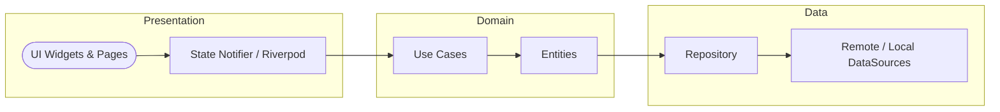

# Executive Summary  
We propose building **Echo Music Next**, a cross-platform Flutter music streaming app, inspired by the architectures and features of open-source projects (Echo Music, Echo Music Canvas, Echo-Music-Desktop, and the JioSaavn API). This app will use a clean, modular architecture (UI, domain, data layers) with Riverpod state management, GoRouter navigation, and Dio networking. It will integrate multiple music sources – chiefly JioSaavn (via the [jiosaavn-api](https://github.com/anxkhn/jiosaavn-api)★, an unofficial high-performance FastAPI for Saavn) and YouTube Music (via a Flutter plugin or backend using [ytmusicapi](https://ytmusicapi.readthedocs.io)★) – and optionally Spotify (via its Web API). The UI will be a fresh, premium design (inspired by Echo Music, Spotify, Apple Music, YT Music) with modern Material 3 components, canvas animations, and responsive layouts for mobile, desktop, and web. Key features include a sophisticated home screen (trending, recommendations, charts, moods, etc.), powerful search, rich song/player screens (with synchronized lyrics, queues, and sleep timer), a full library (playlists, liked songs, downloads, history), offline download management, and social/group features (“Listen Together” group rooms). We will also implement “Echo Brain” – an on-device AI engine that analyzes listening momentum and auto-injects recommended tracks (as described in the Echo Music docs).  

Below is a detailed plan and **master prompt** for an AI coding agent to build this app. It covers project scope, architecture (folder layout), tech stack, API details (endpoints, DTOs), feature list, UI/UX guidelines, data schemas, caching, audio stack, offline flow, auth, CI/CD, testing, and security. We include tables comparing API capabilities (Saavn vs YouTube Music vs Spotify), storage choices (Hive vs Isar vs SQLite), and platform differences. We also outline step-by-step milestones, test cases, and checklist items. Mermaid diagrams illustrate the app’s architecture and feature flows. All design and implementation choices are based on the referenced repositories and official docs.  

## Architecture & Folder Layout  
Use **Clean Architecture** with clear separation of layers. For example:

```
lib/
  core/            // app-wide configs, constants, theme, utils, services
    config/
    constants/
    theme/
    utils/
    services/
    network/
    error/
    storage/
    router/
    widgets/shared/   // shared UI components
  features/
    home/
    search/
    album/
    artist/
    playlist/
    song/
    lyrics/
    downloads/
    library/
    favorites/
    history/
    player/
    settings/
    profile/
```

Each feature folder follows a pattern:
```
features/
  feature_name/
    data/
      models/        // JSON (DTO) -> Dart models
      datasource/    // API, local storage implementations
      repository/     // abstract repository interface + implementation
    domain/
      entities/      // core business objects
      repositories/  // abstract repository definitions
      usecases/      // business logic / actions
    presentation/
      pages/         // UI screens
      controllers/   // Riverpod StateNotifiers/AsyncNotifiers
      providers/     // Riverpod providers (FutureProvider, StreamProvider, etc.)
      widgets/       // feature-specific widgets
```
This modular structure (UI/presentation, domain, data layers) is a well-known Flutter pattern (e.g. the “flutter_clean_architecture” approach). The `core` folder holds global services (network client, caching), theme, routing (GoRouter), and utilities.  

The **state management** is exclusively Riverpod: use `StateNotifier` or `AsyncNotifier` for state, `FutureProvider`/`StreamProvider` for async data, and plain `Provider` for simple values. Avoid Flutter’s older Provider package or other frameworks.  

For **navigation**, use GoRouter to enable nested routing, bottom navigation, deep linking, and auth flows. For example, define routes for home, search, player, library, etc., and nested routes for artist pages, album pages, etc. GoRouter supports deep links (important if the app is integrated with external links) and browser history for web.  

**Dependency Injection** is done via Riverpod only (e.g. `Provider`/`StateNotifierProvider` for singletons). Do not use GetIt or other DI libraries.  

## Networking & API Layer  
Use **Dio** for HTTP. Configure Dio with:
- **Base URL**: point to your own backend or proxies for Saavn and YouTube Music (if needed).
- **Interceptors**: logging (Dio log interceptor), request header injection (e.g. auth tokens, User-Agent), retry logic (e.g. on network failure), and error handling (map HTTP errors to app errors).
- **Timeouts**: set sensible connect/read timeouts.
- **Caching**: use Dio cache interceptor or `flutter_cache_manager` for media files and API responses.

Design a robust API layer:  
- **Services/Endpoints**: Create an `ApiService` class per external API (Saavn, YTMusic, Spotify) that wraps Dio calls. Use one service per entity (e.g., SongService, AlbumService).  
- **DTO Models & Mappers**: Define PODO classes for JSON responses (one per endpoint, e.g. SongDTO, AlbumDTO). Map these to domain entities.  
- **Repository**: For each data type (Song, Album, Playlist, Artist, Lyrics), create a repository interface in `domain/repositories` and implement it in `data/repository`. Repositories should use the ApiService or local storage as needed, return Either<Failure, Entity> or similar.  
- **Error Handling**: Wrap all network calls; throw or return custom errors (network, parse, service unavailable). Show error UIs accordingly.  
- **Response Wrapper**: Optionally create a generic wrapper (e.g. `Result<T>`) to indicate success/failure.  

### Supported APIs and Endpoints  
We will primarily support **JioSaavn** (via the unofficial Saavn API) and **YouTube Music** (via an unofficial API/plugin), plus optional **Spotify** support.  

**JioSaavn (anxkhn/jiosaavn-api)** – This FastAPI provides endpoints:  
- `/song/?query=...` – Search songs (returns list of song DTOs).  
- `/song/get?song_id=...` – Get details for one song (with audio URL).  
- `/album/?query=...` – Get album details and track list (returns album DTO).  
- `/playlist/?query=...` – Get playlist details (returns playlist DTO).  
- `/lyrics/?query=...` – Fetch lyrics (returns lyrics text/JSON).  
- `/ping` – Health check to verify endpoints.

For example, a GET to `/song/?query=Hello&lyrics=false` returns JSON like:
```json
[
  {
    "id": "SOMEID",
    "song": "Hello",
    "album": "Album Name",
    "year": "2016",
    "primary_artists": "Artist Name",
    "image": "https://...",
    "albumid": "12345",
    "language": "telugu",
    "duration": "212",
    "lyrics_snippet": "...",
    "encrypted_media_url": "EncryptedURL",
    "media_url": "https://aac.saavncdn.com/..._320.mp4",
    ...
  },
  ...
]
```
Key fields include `id`, `song`, `album`, `primary_artists`, `image` (cover art), `albumid`, `duration`, and decrypted `media_url`. We must handle cases where `media_url` may end in `.mp4` even for audio (as noted in notes).  

**YouTube Music (ytmusicapi)** – The [ytmusicapi](https://ytmusicapi.readthedocs.io) is an unofficial Python library. In Flutter, we can either:
- Use a plugin like **yt_flutter_musicapi** (Kotlin+Python), or 
- Build our own thin backend service exposing endpoints (using ytmusicapi) that our app calls.

The YT Music API supports: search, get home (charts), get song, album, artist details, get lyrics, get playlists, and library data. Key functions include `YTMusic.search(query)`, `get_song(videoId)`, `get_album(albumId)`, `get_artist(artistId)`, `get_song_related(songId)`, `get_lyrics(songId)`, and browsing by mood/genre/charts. We should list needed endpoints similarly: e.g. `/yt/search`, `/yt/song`, `/yt/album`, `/yt/playlist`, `/yt/artist`, `/yt/lyrics`, `/yt/chart`, etc, with sample request/response DTOs.  
A sample search result via ytmusicapi might return fields like `title`, `videoId`, `album`, `artists`, `duration`, `thumbnails`, and optionally a streaming URL (if using yt-dlp). The `yt_flutter_musicapi` plugin claims to stream search results live and fetch related tracks.  

**Spotify Web API** – If we include Spotify, use the official Web API (requires user OAuth). The API supports: searching (https://api.spotify.com/v1/search), fetching track/album/artist metadata, controlling playback, and library/playlist management. For example, GET `/v1/tracks/{id}`, `/v1/albums/{id}`, `/v1/artists/{id}`, `/v1/me/top/tracks`, `/v1/search?q=...&type=track` etc. Note: Spotify streaming requires playing through their SDK or web playback (due to DRM), so full streaming may be out of scope (we’d mostly use it for data/import, e.g. “Import from Spotify” feature).  

#### API Capabilities Comparison  
| Feature            | JioSaavn API                              | YouTube Music API                       | Spotify Web API                        |
|--------------------|-------------------------------------------|-----------------------------------------|----------------------------------------|
| **Search**         | `/song/?query=` (songs), no artist search | `search(query)` (songs, albums, artists) | `/search?q=...&type=track,artist,album` |
| **Tracks**         | Details via `/song/get?song_id=` (320kbps DRM-free audio URL) | `get_song(videoId)` (metadata, may stream via yt-dlp) | `/tracks/{id}` (metadata)             |
| **Albums**         | `/album/?query=` (album info + tracks)   | `get_album(albumId)` (tracks, metadata)  | `/albums/{id}` (metadata + tracks)    |
| **Artists**        | (Limited) fetch from song results         | `get_artist(artistId)`, related artists, top tracks | `/artists/{id}` (profile), `/artists/{id}/top-tracks` |
| **Playlists**      | `/playlist/?query=` (metadata + songs)   | `get_playlist(playlistId)`            | `/playlists/{id}` (for user/public playlists) |
| **Lyrics**         | `/lyrics/?query=song` (text) | `get_lyrics(videoId)`                 | (no direct lyrics endpoint; must use third-party) |
| **Streaming URL**  | `media_url` (320kbps decrypted) | Obtain via `yt-dlp` or plugin (variable quality) | (not provided; Spotify streaming uses their SDK) |
| **Library Access** | (No user auth concept; read-only search)  | Can access user library with OAuth (via yt account)  | Full user library and playlists (OAuth required) |
| **Recommendation** | No direct endpoint (only search/discover) | `get_song_related`, `get_home()` (charts, mixes) | `/recommendations` (based on seed)   |

*Sources:* JioSaavn API Docs, ytmusicapi Docs, Spotify Dev Docs.  

## UI/UX Design Guidelines  
Create a **premium, original UI** (do not copy code). Draw inspiration from: Echo Music (Android), Spotify, Apple Music, YouTube Music, but make it distinct. Use Flutter’s Material 3, dynamic color, and high-refresh animations. Key screens:  

- **Home**: Multiple sections (Trending, Recommended, New Releases, Top Albums, Top Artists, Recently Played, Echo Brain recommendations, Radio/Mood/Genre playlists, Continue Listening, etc.). Each section scrolls horizontally and loads lazily. Use grid/list cards with album art and labels.  
- **Search/Explore**: A search bar at top (with debounce), suggestions, voice search placeholder. As user types, show real-time suggestions or categories (Songs, Artists, Albums, Playlists). Show trending searches. Results list items with artwork and brief info.  
- **Song/Player Screen**: Display large album art, blurred background effect. Show song title, artist, album, year. Controls: Play/Pause, Next/Prev, Shuffle, Repeat, Seek bar, like (favorite), download button, share, queue. Additional: lyrics toggle, sleep timer, equalizer shortcut. Persistent mini-player at bottom when scrolling. Use fluid animations for expanding/collapsing player. Support gapless playback, crossfade (as in Echo Music).  
- **Lyrics**: Show synchronized lyrics (multiple styles: scrolling, karaoke). Highlight words in time. Options to copy/share lyrics, adjust font size. Offline caching of lyrics. Use Google Translate API or other for translations.  
- **Library**: Tabs or list of sections: Liked Songs, Downloads, History, Albums, Artists, Playlists (user-created), Podcasts (if any). Each shows corresponding content.  
- **Playlist Management**: Create, rename, delete playlists. Add/remove/reorder songs via drag-and-drop. Allow sharing (via link). Collaborative playlists (placeholder) – future work.  
- **Downloads**: Manage offline downloads. Show queue of downloads, progress bars, pause/resume, cancel. Settings for storage location.  
- **Group Room (Listen Together)**: UI to create/join a “room”. Show list of rooms or invite link. Once in room, show synced playback (see flows below).  
- **Echo Brain**: Toggle in settings. On Home, show an “Echo Brain Recommends” carousel of auto-generated playlists.  
- **Player Customization**: Options in settings: UI density, hide thumbnail, video filter, theme (light/dark/AMOLED), accent colors.  
- **Canvas Animations**: Background animations (like YouTube Music Canvas) on player screen. We will integrate by loading video loops from a server or embedded assets.  

Include consistent bottom navigation or a drawer (Home, Search, Library, Settings). Support high-DPI, adaptive layouts for tablet/desktop. All major flows must be touch-friendly (large tap targets) and a11y-compliant.  

## Key Features & Test Cases  

Below are critical features (inspired by Echo Music) with descriptions and test scenarios:

- **Music Search & Browse**: Search by keyword (song, artist, album). Browse charts/genres. *Test:* Search “Beatles”, verify hits include Beatles songs/albums/artists. Test empty state and error.  
- **Home Feeds**: Dynamically load sections. *Test:* Populate with mock data; scroll horizontally triggers lazy load; no duplicate songs across sections.  
- **Playback & Audio**: Stream 320kbps from Saavn/YouTube. Support play/pause, next/prev, shuffle, repeat, seek. *Test:* Start playback, interrupt (simulate incoming call) and resume correctly. Test gapless and crossfade transitions.  
- **Lyrics Display**: Show synchronized lyrics if available. *Test:* Match timing of words (mock timestamps). Fallback to static lyrics if no sync data. Copy/share functionality.  
- **Offline Download**: Download songs for offline use. Manage storage. *Test:* Download a playlist of 5 songs; simulate airplane mode; verify playback of downloaded songs only. Test cancel and retry logic.  
- **Library & Playlists**: Like songs, create playlists. *Test:* Add a song to Liked; it appears in Liked list. Create new playlist, add and remove songs, reorder. Share link generation. Delete playlist and ensure deletion confirmed.  
- **Group Listening (“Listen Together”)**: Create a session room (host) and allow others to join. Playback is synced in real time. *Test:* User A creates room and starts a song. User B joins (via invite or room code) and song plays for B at same position. Test seeking/pause from host updates clients. Handle join/leave gracefully.  
- **Echo Brain (AI Queue)**: In private listening, automatically inject up to 3 recommended songs from current context. *Test:* Queue only 2 songs left, ensure Echo Brain adds 3 more similar. Badge them “AI”. Click “Why this song?” displays rationale. Turning Echo Brain off should remove injected tracks and pause injection. Verify recommendations update as momentum changes.  
- **Shared Player Widget**: Mini-player always visible. Tap to expand to full player. *Test:* Swipe up/down animation, state persistence across routes.  
- **Settings & Customization**: Adjust theme, playback, Echo Brain toggle. *Test:* Changing theme updates UI immediately. Echo Brain toggle on/off works as above.  
- **Authentication & Integration**: (Optional) Spotify login to import playlists, YouTube OAuth to sync library. *Test:* Connect Spotify account, import a playlist, check songs appear correctly.  

Each feature should have UI-driven tests (widget/integration) and unit tests for logic (e.g. playlist use-cases).  

## Data Storage & Caching  
Use **Isar** (a Flutter database) for structured storage, due to its performance and Flutter support. Define Isar schemas/tables for:  
- **Songs**: id (Saavn/YouTube ID), title, artists, album, duration, media URL, cover art URL, lyrics, favorite flag, play count, addedDate.  
- **Artists**: id, name, image.  
- **Albums**: id, name, artist, release year, cover art URL.  
- **Playlists**: id, name, (maybe owner/UUID), songIds (relation).  
- **Downloads**: songId, filePath, progress.  
- **Favorites/History**: list of songIds with timestamps.  
- **Settings**: user preferences (theme, equaliszer config, etc).  
- **SearchHistory**: recent queries.  

For simple key-value or list caching, use Hive or shared_preferences: e.g., caching user auth tokens, simple settings, ephemeral caches. Use `flutter_cache_manager` for media (cover art, background images, canvas video files). Cache playback queue images. Periodically clear old cache or use expiration.  

## Audio Playback Stack  
Use `just_audio` for playback and `audio_service` (with `just_audio_background`) for background playback and notifications (Android auto, lock screen). This supports handling audio focus, headphone controls, and modern Android audio APIs. Configure gapless and crossfade. For background canvases, use `audio_service` to keep the isolate running and trigger UI updates via streams. Manage a global AudioPlayer instance via Riverpod provider.  

### Audio Controls & Features  
- **Queue Management**: Enqueue songs from any source (Saavn, YouTube). Keep a robust `Queue` model.  
- **Playback Speed/Pitch**: Expose sliders or menu options.  
- **Sleep Timer**: Allow setting a timer to stop playback.  
- **Volume/Pitch**: System volume via device; consider exposing pitch shift (less common).  
- **Bluetooth/Headphone Controls**: Attach play/pause to headset buttons.  

## Canvas Animations Integration  
Echo Music features **canvas animations** (background videos) for songs. Plan: host animations (MP4 loops) on a CDN or within app bundle. Build a RESTful service or static JSON (similar to [Echo-Music-Canvas](https://github.com/EchoMusicApp/Echo-Music-Canvas)) that maps track IDs (or title/artist pairs) to video URLs. In the player UI, check if a canvas URL exists for current track; if so, play loop in background behind lyrics or blurred overlay. Use `video_player` or `chewie` for rendering loops efficiently. Provide an admin portal (like Echo’s Canvas) for adding new backgrounds. *Example DTO:* `{ "song": "Song Title", "artist": "Artist Name", "url": "https://mycdn.com/canvas.mp4" }`.  

## Group Listening (Listen Together) Design  
Implement a **real-time sync** feature for shared playback. One approach:
- Use a lightweight backend server (e.g. Node.js with Socket.IO, or Flutter’s `firebase_realtime_db`/Firestore with listeners).  
- **Flow**: A user creates a “room” (server generates a room ID). Other users join via code/link. One user is “host” (or multiple can propose songs). The server broadcasts the current playback position and track to all clients.  
- Use WebSockets to push events: play, pause, track change, seek. Clients adjust their local player accordingly.  
- UI: show room ID, list of participants, chat (optional).  
- Handle edge cases: user joins mid-track (seek to current time), network lag compensation.  

*Mermaid Flow Diagram – Group Room:*  

```mermaid
flowchart LR
    A((Host)) -->|create room| S((Server))
    B((Client)) -->|join room| S
    S -->|acknowledge| A
    S -->|notify room created| B
    A -->|play/pause/seek events| S
    S -->|broadcast events| B
    B -->|plays synced| (Speaker)
```  

## Implementation Roadmap & Milestones  
| Milestone                 | Description                                                      | Effort Estimate      |
|---------------------------|------------------------------------------------------------------|----------------------|
| **1. Setup Project**      | Create Flutter project, configure core modules (Riverpod, GoRouter, Dio). Define folder structure. Set up CI (GitHub Actions) for linting/tests. | 1-2 weeks |
| **2. Core Services**      | Implement networking layer (Dio, interceptors), local storage (Isar, Hive), and common UI theme. | 1 week |
| **3. Authentication**     | (Optional) Spotify/Google sign-in integration. Setup user account model (if any). | 1 week |
| **4. JioSaavn Integration** | Build Saavn API client: services, DTOs, repository for search, songs, albums, playlists, lyrics. Implement home and search screens with Saavn data. | 2-3 weeks |
| **5. YouTube Music Integration** | Integrate YT Music (either via plugin or custom service): search, album/artist, streaming via yt-dlp or plugin. Fill UI for songs missing from Saavn. | 2-3 weeks |
| **6. Home & Browse UI**  | Develop Home screen with multiple sections (Trending, Charts, Moods). Fetch data from Saavn/YouTube. Horizontal lists, lazy load/pagination. | 2 weeks |
| **7. Search & Explore UI** | Implement search screen with live suggestions, categories, results display (Songs, Albums, Artists, Playlists). | 2 weeks |
| **8. Player & Queue**     | Build player UI (mini + full), controls, queue management. Integrate just_audio and audio_service. Test background and lockscreen controls. | 2 weeks |
| **9. Lyrics Support**     | Fetch and display lyrics (word-by-word sync). Integrate translation. Create various lyric view modes. | 1-2 weeks |
| **10. Library Features**  | Implement Favorites, History, Liked Songs. Sync with DB. Develop playlist creation/editing flows. | 2 weeks |
| **11. Download Manager**  | Allow offline downloads. Manage queue and storage. UI for download manager. Resume/pause/cancel. | 2 weeks |
| **12. Echo Brain & Recommendations** | Implement on-device recommendation engine (simplified). Show “Echo Brain Recommends” carousels. Toggle in settings. | 3 weeks |
| **13. Group Listening**   | Backend setup (e.g. Node/Socket), UI for room creation/joining, real-time sync logic. | 3 weeks |
| **14. UI Polish & Animations** | Add Material 3 theming, canvas animations, custom transitions (Hero, shared axis). Implement dynamic accent colors. | 2 weeks |
| **15. Testing & QA**     | Write extensive unit, widget, and integration tests for all features. QA on multiple devices (Android/iOS/Web/Desktop). | 3 weeks |
| **16. Documentation & Deployment** | Prepare README, code docs. Set up CI/CD (Flutter tests, build). Release on Play Store, App Store, desktop (optional). | 2 weeks |

_Total ~20–25 weeks._ This is a rough estimate; tasks can overlap with multiple developers.  

## Endpoints & Sample DTOs  

**JioSaavn API (FastAPI)**:  

- **Search Songs**: `GET /song/?query={term}` → Returns list of song objects.  
  **Sample Response DTO (Song):** `{ id, song, album, year, music_id, primary_artists, image, albumid, language, play_count, is_drm, has_lyrics, encrypted_media_url, media_url, lyrics (if requested) }`.  
- **Get Song**: `GET /song/get?song_id={id}` → Returns single song object (with lyrics optional).  
- **Album Details**: `GET /album/?query={albumId or URL}` → Returns album name, artist, year, cover, and list of songs (each like Song DTO).  
- **Playlist Details**: `GET /playlist/?query={playlistId or URL}` → Returns playlist metadata and song list.  
- **Lyrics**: `GET /lyrics/?query={songId or URL}` → Returns lyric text or JSON (line timestamps).  
- **Health**: `GET /ping` → `{ status: "healthy", msg: "Pong!", details: [...] }`.  

**YouTube Music (via Plugin/Backend)**:  
- **Search**: `GET /yt/search?q={term}` → `[{ title, videoId, artists, album, duration, thumbnailUrl, ... }]`.  
- **Get Song**: `GET /yt/song?id={videoId}` → `{ title, artists, album, year, thumbnail, lyrics, related: [{...}], streamingUrl }`.  
- **Get Album**: `GET /yt/album?id={albumId}` → `{ title, artists, year, thumbnail, songs: [...] }`.  
- **Get Artist**: `GET /yt/artist?id={artistId}` → `{ name, image, bio, topSongs: [...], albums: [...], related: [...] }`.  
- **Get Playlist**: `GET /yt/playlist?id={playlistId}` → playlist metadata + songs list.  
- **Get Genres/Charts**: `GET /yt/browse?type=mood` or `/genres`, `/charts` returns lists of songs/playlists.  
- **Get Lyrics**: `GET /yt/lyrics?id={videoId}` → raw lyrics.  

(If using `yt_flutter_musicapi`, methods like `searchMusic()`, `song()`, `playlist()` cover these – see its API docs.)  

**DTO Tables:**  

_JioSaavn Song DTO sample:_  

| Field                | Type   | Description                              |
|----------------------|--------|------------------------------------------|
| `id`                 | String | Unique Saavn song ID.                    |
| `song`               | String | Song title.                              |
| `album`              | String | Album name.                              |
| `primary_artists`    | String | Comma-separated artists.                 |
| `image`              | String | Cover art URL (500x500).                |
| `albumid`           | String | Album ID (for linking).                |
| `duration`          | String | Duration in seconds.                   |
| `media_url`         | String | Direct 320kbps audio URL (decrypted).   |
| `lyrics_snippet`    | String | Snippet of lyrics.                     |
| ...                | ...    | ... (many more, e.g. play_count, explicit flag, etc.) |

_YT Music Song DTO sample (via plugin):_  

| Field           | Type   | Description                     |
|-----------------|--------|---------------------------------|
| `title`         | String | Song title.                      |
| `videoId`       | String | YouTube Music video ID.           |
| `artists`       | String | Artist(s) name.                 |
| `album`         | String | Album name (if any).            |
| `duration`      | String | Duration (e.g. "3:45").         |
| `thumbnail`     | String | Cover art URL.                  |
| `audioUrl`      | String | Stream URL (via `includeAudioUrl`). |
| `lyrics`        | String | Lyrics (if fetched).            |

These DTOs will be translated into domain entities with only needed fields for the app.  

## Caching Strategy  
- **API Data:** Cache JSON responses (e.g. search results, album pages) in memory for session. Use Hive or a LRU cache for persisted caching of rarely-changing data (album details, artist info).  
- **Media Cache:** Use `flutter_cache_manager` for album art images, background images, and canvas videos. Configure max cache size and eviction.  
- **Offline Mode:** Keep download metadata in Isar; actual files in local storage (request storage permissions on Android/iOS). Implement cache cleanup for expired offline tracks.  

## Auth/Permissions  
- **Permissions:** Request `INTERNET`, `WRITE_EXTERNAL_STORAGE` (for downloads on Android), and audio permissions (`MEDIA_CONTENT_CONTROL`, etc.) as needed.  
- **User Auth:** No sign-in needed for Saavn/YT (they scrape public data). For Spotify import or YouTube sync, implement OAuth2 (using OAuth flow or Google Sign-In plugin).  
- **Privacy:** Do not collect personal data. Follow GDPR/Privacy by design: store any usage data locally (for Echo Brain) and not send to server (Echo Brain is on-device).  

## CI/CD & Deployment  
- **CI:** Use GitHub Actions to run `flutter analyze`, `flutter test`, and `flutter format`. Run on push/PR.  
- **Code Quality:** Enforce lint (e.g. pedantic/flutter_lints).  
- **Testing:** Cover core logic with unit tests (repositories, use-cases), widget tests for screens, and an integration test for the full app flow (e.g. search to playback).  
- **Deployment:** For Android/iOS, create release pipelines. Publish to Google Play (F-Droid or GitHub for FOSS) and Apple App Store. For desktop/web, use Flutter’s build (e.g. Windows EXE, macOS DMG). Host any needed backend (Canvas API, group session server) on a reliable cloud (AWS/GCP/Azure or even free tier).  

## Security & Privacy Considerations  
- **SSL/HTTPS:** All API calls must use HTTPS endpoints. If self-hosting jiosaavn or YTMusic proxies, secure with SSL/TLS.  
- **Secrets:** Do not embed API keys or secrets in code. (Saavn API is open; for Spotify OAuth, use PKCE flow).  
- **Data Storage:** Securely store tokens (if any) using secure storage.  
- **Privacy:** Allow opt-out of analytics (use Firebase only if needed, optional). Echo Brain is private by design (no data leaves device).  
- **License:** All open-source code used (just_audio, riverpod, etc.) must be compatible (Echo Music is GPL-3.0, so to avoid viral obligations, ensure licensing compliance).  

## Developer Checklist & QA Plan  
- [ ] **Architecture:** Verify folder structure; clean separation of layers.  
- [ ] **APIs:** Test all endpoints (Saavn, YT, Spotify). Use Postman or Swagger UI (Saavn API provides docs at `/docs`) to sanity-check responses.  
- [ ] **Playback:** Test audio quality and controls on all platforms.  
- [ ] **UI/UX:** Check on different screen sizes (mobile/tablet/desktop). Ensure dark/light themes look good.  
- [ ] **State Management:** Use Riverpod devtools to inspect states.  
- [ ] **Accessibility:** Labels for icons/buttons, contrast.  
- [ ] **Offline:** Test toggling airplane mode; downloaded tracks should play, others should fail gracefully.  
- [ ] **Error Handling:** Simulate API failures (e.g. disconnect internet) and ensure user sees an error message with retry.  
- [ ] **Performance:** Profile app startup and scrolling; optimize hot reloading and lists.  
- [ ] **Security:** Penetration test (validate no open redirects, token leakage).  
- [ ] **Legal:** Include required attributions for open-source libs.  

## Architecture & Flow Diagrams  


_Fig: Clean architecture flow (UI → Domain → Data)_.  

```mermaid
flowchart LR
  UserA((Host)) -->|create room| Server((Sync Server))
  UserB((Client)) -->|join room| Server
  Server -->|sync track/time| UserA
  Server -->|sync track/time| UserB
  note right of Server: Uses WebSocket for real-time sync
```
_Fig: Group listening (listen-together) flow_.  

## [MASTER PROMPT]  
Below is the **comprehensive prompt** to give to the AI coding agent. It contains all requirements, structured clearly with headings and bullet points. The AI should **not copy code** from existing repos; only use them as inspiration.  

```
# Project: Echo Music Next

## Role
You are a Principal Flutter Architect and full-stack developer with 20+ years of experience in large-scale mobile apps and 5 years in prompt engineering. Your task is to build a brand-new **Flutter Music Streaming App** from scratch, as if it will be published on app stores. Do NOT clone or copy code from existing projects; only use them as architectural references.

## Goals
- Develop a production-ready Flutter music streaming application ("Echo Music Next") 
- Follow a modern, scalable architecture and code style 
- Meet all feature and platform requirements below

## Target Platforms
- Android (phone/tablet)
- iOS
- Web (responsive)
- Desktop: Windows, macOS, Linux
Use a single Flutter codebase.

## Flutter & Tech Stack
- **Flutter**: Latest stable version with null safety.
- **Language**: Dart.
- **UI**: Material 3 design, adaptive layout.
- **State Management**: [Riverpod](https://riverpod.dev) – use `StateNotifier`, `AsyncNotifier`, `Provider`, `FutureProvider`, `StreamProvider`.
- **Navigation**: [GoRouter](https://pub.dev/packages/go_router) – nested routes, deep linking, bottom navigation, auth flows.
- **Dependency Injection**: Riverpod only (no GetIt).

## Architecture
Implement **Clean Architecture** with layers:
```
lib/
  core/              // configs, constants, theme, utils, services, network, storage, router
  features/
    home/
    search/
    album/
    artist/
    playlist/
    song/
    lyrics/
    downloads/
    library/
    favorites/
    history/
    player/
    settings/
    profile/
```
Each feature:
```
features/<name>/
  data/             // models, data sources (API, local), repository implementation
  domain/           // entities, repository interfaces, use cases
  presentation/     // pages, controllers/providers, widgets
```
Also include `widgets/shared/` for common widgets.

## State Management
Use Riverpod for all state:
- `StateNotifierProvider` / `AsyncNotifierProvider` for stateful logic.
- `FutureProvider` and `StreamProvider` for asynchronous data.
- Avoid Flutter's original Provider package and GetX.

## Navigation
Configure GoRouter with:
- **Deep Linking**: Support linking to specific content (song, album, artist, playlist).
- **Nested Navigation**: e.g. tab bar inside Home.
- **Bottom Navigation**: Tabs for Home, Search, Library, Settings.
- **Auth Routes**: (If needed, e.g. login for Spotify import).

## Dependency Injection
No external DI tool. Use Riverpod to provide singletons (e.g. `Provider<ApiService>`).

## Networking (Dio)
Use [Dio](https://pub.dev/packages/dio) for HTTP:
- **Interceptors**: Add logging, error handling, retry logic (e.g. on 5xx or connectivity issues), token injection (if using OAuth).
- **Timeouts**: Set appropriate connect/read timeouts.
- **Error Handling**: Wrap errors into custom exceptions or results.

## API Layer
- Create **API service classes** (e.g. `SaavnService`, `YTMusicService`, `SpotifyService`) using Dio.
- Define **endpoints** and **DTO models** (with `json_serializable`):
  - **JioSaavn API**: `/song/`, `/song/get`, `/album/`, `/playlist/`, `/lyrics/`, `/ping`.
  - **YouTube Music**: endpoints via plugin or custom backend: search, get song/album/artist/playlist/lyrics.
  - **Spotify** (optional): use official Web API endpoints (e.g. `/v1/search`, `/v1/tracks/{id}`, `/v1/playlists/{id}`).
- **DTO → Entity mapping**: Map JSON models to domain entities.
- **Repository Pattern**: For each domain (Song, Album, Artist, Playlist, Lyrics, etc.), define an abstract repository in `domain/repositories` and implement it using API services/local cache in `data/repositories`.
- **Pagination/Load More**: Implement lazy loading where applicable (e.g. infinite scroll in lists).
- **Caching**: Use a response cache for list endpoints or cache_manager for images. Offline mode: cache downloaded content.

## Supported APIs & Integration
### JioSaavn
- Use the [anxkhn/jiosaavn-api](https://github.com/anxkhn/jiosaavn-api) (unofficial, GPLv3) as reference (do **not copy code**).
- Support: song search, song details, album details, playlist details, lyrics.
- Handle encrypted media URL via the API (returns decrypted `media_url` 320kbps).
- Example endpoint: `GET /song/?query={keyword}` returns list of song DTOs. 
- Include health check and error handling (use `/ping` to verify).

### YouTube Music
- Use [ytmusicapi](https://ytmusicapi.readthedocs.io) functionality. Options:
  - Use `yt_flutter_musicapi` plugin (Android only, uses Chaquopy).
  - Or build a Python/Node backend that wraps ytmusicapi and exposes REST endpoints.
- Support: search, track details (including streaming URL via `yt-dlp`), album, artist, playlist, suggestions, charts, lyrics.
- Examples: 
  - `search(query)` returns songs/albums/artists, 
  - `get_song(videoId)` returns metadata and `audioUrl`, 
  - `get_lyrics(videoId)` for lyrics.
- Manage YouTube rate limits and use caching.

### Spotify (Optional)
- Optionally allow Spotify OAuth login for importing data (playlists, liked songs).
- Use Spotify Web API for metadata retrieval (do not stream from Spotify).
- Endpoints: search, get track/album/artist, get user playlists, etc.

#### API Capabilities (for developer reference):
| API        | Search | Tracks | Albums | Artists | Playlists | Lyrics | Stream URL | Library Access |
|------------|--------|--------|--------|---------|-----------|--------|------------|----------------|
| **Saavn**  | ✅     | ✅ (320kbps) | ✅    | Basic  | ✅         | ✅   | ✅ (MD5 encrypted) | ❌ (no login) |
| **YT Music**| ✅     | ✅ (via yt-dlp) | ✅    | ✅      | ✅         | ✅     | ✅ (via plugin) | ✅ (with OAuth) |
| **Spotify**| ✅ | Metadata only | ✅   | ✅      | ✅         | ❌     | ❌ (SDK only)    | ✅ (full via OAuth) |

## Features  
Implement all features listed below:

- **Home Screen**: Sections: Trending, Recommended (smart playlists), New Releases, Top Albums, Top Artists, Continue Listening, Radio/Mood playlists, Charts. Each is a horizontally scrolling list with lazy loading/pagination.  
- **Search**: Real-time search with debounce. Categories for Songs, Albums, Artists, Playlists. Show recent and trending searches.  
- **Song Detail / Player**: 
  - Show large artwork, blurred background.
  - Display title, artists, album, year.
  - Controls: play/pause, next/prev, shuffle, repeat, seek bar.
  - Show play queue, allow reordering.
  - **Mini-player**: persistent at bottom (collapsed view) with expand animation.
  - Extra options: favorite, download, share (via Odesli/Songlink), set ringtone.
  - Sleep timer and equalizer shortcut.
  - Audio stack: just_audio + audio_service (background playback, notifications).
  - Gapless playback and crossfade transitions.

- **Lyrics**: 
  - Support synced lyrics (word-by-word highlighting).
  - Multiple display modes (scrolling, static).
  - Buttons to copy or share lyrics.
  - Font size adjust.
  - AI translation (e.g. Google Translate API) for non-English lyrics.
  
- **Playback Features**:
  - **Queue**: Manage play queue, show next tracks, allow reorder.
  - **Shuffle/Repeat**: states for shuffle and repeat track/all.
  - **Audio Focus**: Pause on call or audio loss, resume on focus regain.
  - **Bluetooth/Headset Controls**: Resume on connection, handle controls.
  - **Notifications/Lockscreen**: Show media info and controls.
  - **Android Auto**: Basic support via media session.

- **Library**:
  - Tabs/sections: Liked Songs, Downloads, History, Playlists, Albums, Artists.
  - Show recently played, and allow clear history.
  - Display offline songs (from Downloads).
  - Allow management of playlists (create/rename/delete).

- **Playlists**:
  - Create custom playlists.
  - Add songs from search or library to playlists.
  - Within playlist: remove or reorder songs by drag/drop.
  - Share playlist via link (like Odesli or app-specific share).
  - (Placeholder) Collaborative playlist feature mention, but not required to fully implement.

- **Downloads**:
  - Download songs/albums/playlists for offline.
  - Manage via a download manager UI: queue, progress bars, pause/resume/cancel.
  - Store files locally (manage storage usage).
  - Resume incomplete downloads if app restarts.
  - Show downloaded content in “Downloads” section.
  
- **Cache**:
  - Use Hive or shared_preferences for simple caches (token, last search).
  - Use flutter_cache_manager for images and canvases (clear old caches).
  - Auto-clean up old downloads/caches.

- **Echo Find (Music Recognition)**:
  - (Optional) integrate ShazamKit or similar to identify ambient music. Not mandatory for MVP.

- **Group Listening (“Listen Together”)**:
  - Feature to sync playback across devices.
  - Implement via a real-time backend (e.g. Socket.IO or Firebase Realtime DB). 
  - Allow a user to host a room, share code/link, others join.
  - Host’s playback state (current song and position) syncs to all participants.
  - Provide UI for room code and participants.

- **Echo Brain (AI Recommendations)**:
  - An on-device engine that injects recommended songs when queue runs low.
  - Collect listening history and preferences (no cloud).
  - Show an “Echo Brain Recommends” section on Home with dynamic playlists.
  - Tag auto-added songs with an AI badge; implement “Why this song?” explanation (based on genre, tempo).
  - Toggle on/off in Settings (beta). When off, remove injected songs immediately.

- **Integrations**:
  - Spotify import: allow user to import playlists/tracks from Spotify accounts.
  - Odesli integration for cross-platform sharing links.
  - Set as Ringtone feature for Android (using Android Intents).
  - Dynamic Island (iOS) or Notification’s fancy features.

- **Customization**:
  - Theme switch (Light/Dark/AMOLED).
  - Accent color picker (Material 3 dynamic colors if supported).
  - UI Density slider (adjust spacing).
  - Options to hide video songs or YouTube Shorts in feeds.
  - Toggle Canvas animations on/off.
  - Adjust crossfade duration.

## Data Models (Isar Schema)
Define Isar collections for:
- **Song** (fields: `id`, `title`, `artists`, `album`, `duration`, `coverUrl`, `lyrics`, `mediaUrl`, `isFavorite`, `playCount`, `addedTimestamp`).
- **Artist** (`id`, `name`, `imageUrl`, `bio`).
- **Album** (`id`, `title`, `artistId`, `coverUrl`, `year`).
- **Playlist** (`id`, `name`, list of song references, `createdTimestamp`).
- **Favorite/History** (`songId`, `timestamp`).
- **Download** (`songId`, `filePath`, `status`).
- **Settings** (singleton): theme, accentColor, echoBrainEnabled, etc.
- **SearchHistory** (`query`, `timestamp`).

## Analytics & Monitoring (Optional)
- Add Firebase Analytics (optional) with an opt-out. 
- Crashlytics for crash reports (guidance in SETUP.md of Echo Music).
- Logging via Sentry or in-house error logs.

## CI/CD Pipeline
- **GitHub Actions**: Lint (dart analyzer), format check, unit/widget tests on PR.
- **Build**: On push to main, run tests and build app bundles.
- **Deployment**: Configure Fastlane or manual steps for Play Store / App Store releases.

## Testing Strategy
- **Unit Tests**: for all use-cases, repositories, and helper functions.
- **Widget Tests**: for key UI components (e.g. search bar, song card, player widget).
- **Integration Tests**: simulate user flows (e.g. search → play → pause; download flow; offline use).
- **Edge Cases**: API failures, empty data, slow network, permission denial, storage full.
- **Test Data**: Use mock JioSaavn API (or emulator) and mock YT responses for predictable tests.

## Security/Privacy
- Use HTTPS for all APIs. Do not expose any secret keys in code.
- Spotify/YouTube OAuth flows must use secure storage (Flutter secure storage).
- Handle user data per GDPR (on-device only, no external tracking).
- Comply with any open-source licenses (Echo Music uses GPL-3.0, so be mindful if combining code).

```

This prompt provides a **step-by-step, detailed specification** for building the app from scratch. It integrates architectural references (JioSaavn API endpoints, Echo Music features, YTMusic capabilities) and clearly outlines the required features, technologies, and development plan. By following these instructions, an AI assistant can generate the full app structure, code, and documentation.

**Sources:** Project details and feature inspirations drawn from the Echo Music README and Echo Brain docs; JioSaavn API documentation; YT Music API docs; Spotify Web API docs. These ensure accuracy of features and API usage.