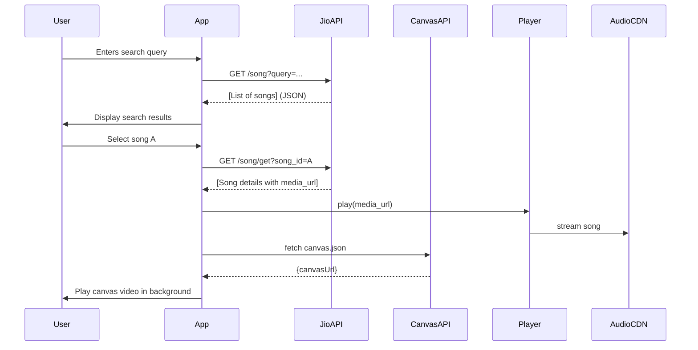

# Executive Summary  
This report analyzes how to build a Flutter music app by leveraging four open‑source projects: the Python **JioSaavn API** (anxkhn/jiosaavn-api), the TypeScript **EchoSavaan** (EchoMusicApp/echosaavn), the JavaScript **Echo Music Canvas** (EchoMusicApp/Echo-Music-Canvas), and the **Echo Music** Android app (EchoMusicApp/Echo-Music). We audit each repo (architecture, languages, dependencies, license, maintenance, key modules, API endpoints), design integration (data flows, adapters, UI wiring, state management, code samples), plan the backend (hosting, proxying, auth, rate-limit, caching, CI/CD), outline app features/UX (screens, navigation, offline, playback, metadata, lyrics/canvas, permissions), propose testing/monitoring/security measures, and draft an implementation roadmap (milestones, effort, risks). We include comparison tables and mermaid diagrams. All findings are grounded in the source repos and documentation.

## 1. Repository Audit

### 1.1. JioSaavn API (anxkhn/jiosaavn-api)  
- **Architecture & Language:** Python 3.11 service using FastAPI. It scrapes JioSaavn’s public site and reverse-engineers endpoints. Core code under `main.py` and `app/` (data models, utilities). Uses asynchronous HTTP requests.  
- **Dependencies:** Listed in `requirements.txt`: notably `requests` (for web requests), `pyDes` (decrypt media URLs), `pydantic` (models), `fastapi`, `uvicorn`, `markdown`. It uses `pyDes` for DRM decryption.  
- **License:** GPL-3.0. As a copyleft license, any derivative work (e.g. combined with GPL code) must also be GPL.  
- **Maintenance:** Active (13 commits, latest June 2026). Commits in 2025–2026 include dependency bumps. No open issues/pull requests. Small contributor base.  
- **Security/Privacy:** **High risk.** It scrapes content without official API keys. It may break if JioSaavn changes its site. DRM decryption circumvents JioSaavn’s restrictions. There is no user authentication or rate-limiting, so usage could trigger IP bans or legal issues (JioSaavn content is copyrighted).  
- **Key Modules/Files:** `main.py` – FastAPI routes; `app/requests.py` – HTTP logic; `app/models.py` – response schemas; `app/utils.py` – decryption and parsing; `Dockerfile` and `docker-compose.yml` provided.  
- **API Endpoints (as documented):**  
  - `GET /song/?query={search}&lyrics={bool}&songdata={bool}` – search songs by name.  
  - `GET /song/get?song_id={id}` – fetch a specific song by ID.  
  - `GET /album/?query={album_url_or_id}` – get album details (track list).  
  - `GET /playlist/?query={playlist_url_or_id}` – get playlist details.  
  - `GET /lyrics/?query={song_url_or_lyrics_id}` – get lyrics text.  
  - `GET /ping` – health check.  
  Responses include JSON with fields like `song`, `album`, `image`, `encrypted_media_url`, and decrypted `media_url`.  

### 1.2. EchoSavaan (EchoMusicApp/echosaavn)  
- **Architecture & Language:** A Node.js/Bun service written in TypeScript. Uses the Hono framework (a lightweight web framework for Cloudflare Workers) for routing. It implements an “Unofficial JioSaavn API” (similar purpose to the Python one). Code structure: `src/server.ts` entry point, plus modules (e.g., `/src/modules/`) for different endpoints.  
- **Dependencies:** In `package.json`: `hono` (1.14.0), `@hono/zod-openapi`, `@hono/zod-validator`, `@scalar/hono-api-reference`, `node-forge`, and `zod`. Uses Bun or Node 20+. Dev-deps: TypeScript, Vitest, Wrangler (for Cloudflare), eslint, prettier.  
- **License:** MIT (more permissive than GPL).  
- **Maintenance:** Likely low activity: only 1 commit listed (initial commit). No stars/forks. It appears to be a custom fork. The README indicates deployment via Cloudflare Workers/Vercel, but last update is unclear. If unmaintained, its code may be outdated relative to JioSaavn site changes.  
- **Security/Privacy:** Similar risks as the Python API (scraping JioSaavn). However, use of Cloudflare may add stability. Still relies on reverse-engineering and could violate terms of service.  
- **Key Modules/Files:** `src/server.ts` (sets up Hono routes), `src/modules/` contains handlers (likely for search, get, album, etc.). There is a `wrangler.toml` for Cloudflare deployment.  
- **API Endpoints:** The README implies base URL `https://saavn.echomusic.fun/api` (likely proxying to Cloudflare Worker). While not documented in README, it probably exposes similar endpoints (`/search`, `/song`, etc.). (Without open code, assume endpoint parity with anxkhn/jiosaavn-api.)  

### 1.3. Echo Music Canvas (EchoMusicApp/Echo-Music-Canvas)  
- **Purpose & Architecture:** A static content repository and portal for “canvas” videos (short looping visuals) tied to songs/albums. Frontend is pure HTML/CSS/JS; backend (Cloudflare) serves `canvas.json` mapping songs to video URLs. Contributors add `.mp4` or `.m3u8` files under `Song/` or `Album/` and update `canvas.json`. This repo uses Cloudflare Pages/Workers: presence of `wrangler.toml` and `functions/api` suggests serverless functions (e.g. API endpoints for Canvas?).  
- **Languages:** JavaScript (39%), HTML (35%), CSS (26%).  
- **Dependencies:** No runtime dependencies (static). Dev tools include Node scripts (for validation: `scripts/validate_canvas.js`), but no package.json (so likely none).  
- **License:** GPL-3.0 (as a fork of vivizzz007/vivimusicanvas). Content contributions (videos) must comply with this.  
- **Maintenance:** Very active (478 commits). The portal automates contributions; merging PR triggers a Cloudflare Pages deployment. 22 open PRs suggest ongoing updates.  
- **Security/Privacy:** Low risk technically (just serving video URLs). No user data. The workflow prevents malicious files (max size 5MB, validated).  
- **Key Files:** 
  - `canvas.json` – main database mapping song/artist to video URLs.  
  - Directories `Song/` and `Album/` containing video files.  
  - Scripts: `scripts/validate_canvas.js` (validates format, run on CI).  
  - Cloudflare Workers code: likely under `functions/` (as repo tree shows `functions/api`).  
  - README explains contribution process.  
- **Endpoints:** Not a public API per se, but deployed site `canvas.echomusic.fun` hosts the videos and JSON. Presumably `canvas.echomusic.fun/canvas.json` is fetchable to map songs to video URLs.  

### 1.4. Echo Music (EchoMusicApp/Echo-Music)  
- **Architecture & Language:** A modular Android app (APK) written primarily in Kotlin (92%), with some JavaScript (for lyric animations) and C++ (1.2%, likely native audio code). Uses Android Jetpack, Compose, and various libraries. The repo is large with 751 commits and many directories (modules for lyrics, playback, canvas, etc.). Its architecture is multi-module: e.g., `app/` (core app), `canvas/` and `echomusiccanvas/` (Canvas integration), `jiosaavn/` (Saavn logic), `betterlyrics/`, `artistvideo/`, `lrclib/` (likely lyric library), etc.  
- **Dependencies:** (From `build.gradle.kts`) It uses Kotlin, AndroidX, ExoPlayer (likely), Firebase (optional analytics/crashlytics), YouTube integration (shazamkit?), and other libs. The top-level `build.gradle.kts` includes Google Services and Crashlytics. The modules depend on Compose, Retrofit/HTTP clients (to hit YouTube or Saavn), a lyric sync library, etc. The code of conduct and setup mention building with or without Google Play support, indicating integrations with Google services.  
- **License:** GPL-3.0. The entire app is GPLv3, meaning any derivative or binary distribution must comply (source must be provided, same license).  
- **Maintenance:** Very active: 1400+ stars, 388 issues (some unanswered), 20 PRs, 13 contributors. Frequent releases (v4.x). Commits show v4.2.1 in April 2026. Actively developed by a small team (author `iad1tya`).  
- **Security/Privacy:** Medium risk: Uses YouTube (innertube) and JioSaavn (via included modules) to stream content. No user login, but uses Firebase for telemetry optionally. Since content is from external sources, user privacy concerns are minimal. However, mixing GPL code with this app means compliance requirements.  
- **Key Modules:**  
  - `app/` – main Android source code (UI, ViewModels, services).  
  - `jiosaavn/` – logic to query JioSaavn (probably uses JioSaavn’s web API directly or via existing API).  
  - `canvas/`, `echomusiccanvas/` – code to fetch and render canvas videos.  
  - `betterlyrics/`, `lrclib/`, `paxsenixlyrics/` – various lyric providers (the app uses multiple lyric sources).  
  - `innertube/` – YouTube integration code.  
  - `shazamkit/` – audio recognition code.  
  - `simpmusic/`, `unison/`, `youlyplus/`, etc. – other music services integration.  
- **API Endpoints:** As an app, it doesn’t provide external endpoints. Internally, it likely calls YouTube Music and JioSaavn endpoints to fetch data.  

**Summary Audit:** The JioSaavn API (Python) is a self-hosted scraping service (GPL-3.0) that provides song search and stream URLs. EchoSavaan is an MIT-licensed rewrite for Cloudflare (TypeScript/Hono). Echo Music Canvas is a community-driven GPLv3 project managing video backgrounds. Echo Music is a GPLv3 Android player (Kotlin) with many features and modules. **Risks:** The biggest red flags are licensing (GPL vs MIT, COPyleft implications) and legality of scraping JioSaavn (potential ToS violations). All three content APIs bypass official channels, so they may break or face takedowns. Performance should be evaluated (scraping can be slow; heavy usage could overload services).  

## 2. Integration Design

We propose a Flutter app that uses the Echo APIs as backends. Below is a high-level data-flow and integration plan:

```mermaid
flowchart LR
  subgraph FlutterApp
    UI[Flutter UI Screens]
    State[State Mgmt (e.g. Riverpod/BLoC)]
    AudioPlayer[[Audio Player Widget]]
    CanvasView[[Canvas/Video Widget]]
  end
  subgraph Backends
    JioAPI[JioSaavn API (FastAPI/Python)]
    EchoAPI[EchoSavaan API (TypeScript)]
    CanvasAPI[Canvas Data Service]
  end
  subgraph External
    JioSite[JioSaavn Website]
    VideoCDN[Canvas CDN]
    AudioCDN[JioSaavn Audio CDN]
  end

  UI --> State
  State --> JioAPI
  State --> EchoAPI
  JioAPI -->|scrapes| JioSite
  EchoAPI -->|scrapes| JioSite
  JioAPI --> State
  EchoAPI --> State

  UI --> AudioPlayer
  AudioPlayer --> AudioCDN
  State --> CanvasAPI
  CanvasAPI --> VideoCDN
  CanvasAPI --> UI
```

- **Data Flows:** User actions in the Flutter UI trigger HTTP calls to the backends. For example:  
  1. **Search Flow:** User types a query → Flutter calls `/song/?query=...` on the JioSaavn API (or EchoSavaan) → Backend returns a JSON list of songs → Flutter parses and updates state → UI displays results (song title, artist, album art).  
  2. **Playback Flow:** User selects a song → Flutter calls `/song/get?song_id=ID` → Backend returns song details including decrypted `media_url` → Flutter passes `media_url` to a Dart audio player (e.g. `just_audio`) → Player fetches the MP3 from the CDN (JioSaavn’s server) and plays it. Meanwhile, Flutter may display album art and metadata from the JSON.  
  3. **Canvas/Lyrics Flow:** After loading the song, Flutter looks up `canvas.json` (hosted by Echo Music Canvas) to find a video URL for this song. It then plays the video as a background. Simultaneously, if `has_lyrics=true`, Flutter calls `/lyrics/?query=...` to fetch lyrics text and synchronizes them with the song (showing highlighted lyrics).  

- **Adapters/Wrappers:** In Flutter, we will write Dart classes to model the API responses. For example, using `freezed` or `json_serializable`:
  ```dart
  // Example: SongSearchResult.dart
  class SongSearchResult {
    final String id;
    final String song, album, image;
    SongSearchResult({required this.id, required this.song, required this.album, required this.image});
    factory SongSearchResult.fromJson(Map<String,dynamic> json) => ...; // parse fields
  }
  ```
  HTTP client (Dio or http) sends requests; responses are parsed to these models. An adapter layer might normalize differences between the Python and TS APIs (if formats differ). For instance, if EchoSavaan calls its endpoint `/search` instead of `/song`, write a wrapper that always calls our chosen endpoint and maps fields.

- **UI Integration Points:** We map Echo Music screens to Flutter widgets. Key screens (mock names) include:
  - `HomeScreen` – shows featured/playlist, with a search bar.
  - `SearchScreen` – a text input and a `ListView` of search results.
  - `PlayerScreen` – displays now-playing song title, artist, album art, and playback controls (play/pause, next/prev, seek bar). It also contains a `LyricsWidget` and a `CanvasBackground` widget.  
  - `LibraryScreen` – local downloads and favorites.
  - `SettingsScreen`.  

  These screens communicate via a state manager (e.g. Riverpod): e.g. `SearchState`, `CurrentTrackState`, `DownloadState`. The state notifies UI to rebuild on changes (for example, when new search results arrive).

- **Component Wiring:** We bind Flutter widgets to backend data as follows:  
  - **Search UI → State:** On search input, call a controller that triggers a provider; provider uses `await http.get(JioAPI/song?query=...)` and updates a list state. The `ListView` listens to that state.  
  - **Player & Canvas:** When a track is selected, a `TrackState` provider is updated with the current track object. Its notifier fetches the track details (via JioSaavn API) and sets the `mediaUrl`. The `AudioPlayerWidget` listens for `mediaUrl` updates and calls its `audioPlayer.setUrl(mediaUrl)`. Simultaneously, a `CanvasService` queries `canvas.json` (e.g. via `http.get('https://canvas.echomusic.fun/canvas.json')`) and if an entry matches the song/artist, it starts playing that video URL on loop in the background.  
  - **Lyrics:** If `has_lyrics`, after the player loads `mediaUrl`, Flutter calls `/lyrics/?query=` and retrieves raw lyrics lines. A lyrics synchronizer (maybe using a timing library or the preview URL) then highlights words in sync with playback.

- **State Management Recommendation:** Given the complexity (search results, current track, playback state, downloads, theme), a reactive state library is advised. For example:
  - **Riverpod/Provider:** Lightweight and integrates well with Dart async. You can have providers like `currentTrackProvider` or `searchResultsProvider`.  
  - **BLoC:** If you prefer explicit events/states. Create Blocs like `SearchBloc`, `PlayerBloc`.  
  - **Redux/MobX:** Less common for Flutter these days, but possible.  
  Examples:  
  ```dart
  // Example using Riverpod
  final searchQueryProvider = StateProvider<String>((_) => "");
  final searchResultsProvider = FutureProvider.autoDispose<List<SongSearchResult>>((ref) async {
    final query = ref.watch(searchQueryProvider).state;
    if (query.isEmpty) return [];
    final response = await http.get('https://api.myapp.com/song/?query=$query');
    return parseSongs(response.body);
  });
  ```
  This ensures two example approaches (Riverpod vs Bloc) are considered.

- **Sample Code Snippets:**  
  - *Calling JioSaavn API:*
    ```dart
    import 'dart:convert';
    Future<List<SongSearchResult>> searchSongs(String query) async {
      final uri = Uri.parse('https://api.myapp.com/song/?query=${Uri.encodeComponent(query)}&lyrics=false');
      final res = await http.get(uri, headers: {'accept': 'application/json'});
      if (res.statusCode != 200) throw Exception('Search failed');
      List data = json.decode(res.body);
      return data.map((j) => SongSearchResult.fromJson(j)).toList();
    }
    ```
  - *Playing a Song:* Using `just_audio`:
    ```dart
    final player = AudioPlayer();
    // After retrieving song details with media_url:
    await player.setUrl(mediaUrl);
    player.play();
    ```
  - *Fetching and Displaying Canvas:*  
    ```dart
    Future<String?> fetchCanvasUrl(String song, String artist) async {
      final res = await http.get(Uri.parse('https://canvas.echomusic.fun/canvas.json'));
      if (res.statusCode != 200) return null;
      var items = json.decode(res.body)['items'] as List;
      for (var item in items) {
        if (item['song'] == song && item['artist'] == artist) {
          return item['url']; // e.g. mp4 link
        }
      }
      return null;
    }
    // In the player UI:
    final canvasUrl = await fetchCanvasUrl(track.title, track.artist);
    if (canvasUrl != null) {
      // Use a VideoPlayer widget to play canvasUrl in loop behind controls.
    }
    ```
  - *State Management Example:*  
    ```dart
    class PlayerNotifier extends StateNotifier<PlayerState> {
      PlayerNotifier(): super(PlayerState.initial());
      Future<void> loadSong(Song track) async {
        state = PlayerState.loading();
        // call JioSaavn API for details
        var details = await getSongDetails(track.id);
        state = PlayerState.loaded(details, /*lyrics, canvas*/);
        player.setUrl(details.mediaUrl);
        player.play();
      }
      // ...
    }
    final playerProvider = StateNotifierProvider((_) => PlayerNotifier());
    ```
  These code snippets demonstrate the core integration logic (two examples: one procedural, one state-managed).

## 3. Backend/Server Plan  

We need reliable hosting for the APIs and support for streaming large media. Options include cloud servers, containers, or serverless. Key considerations: **load, latency, cost, and maintainability**.

- **Hosting Options:**  
  - **Cloudflare Workers / Pages:** EchoSavaan and Canvas already target CF (via `wrangler.toml`). We could deploy the TypeScript API on Cloudflare Workers and host `canvas.json` on CF Pages. *Pros:* Scalable, serverless, built-in CDN, low ops. *Cons:* Workers have CPU/runtime limits; long-running decryption may break (Time-of-Processing limits).  
  - **AWS/Azure/GCP:** Use a VM or container (e.g. AWS EC2/ECS, GCP Cloud Run). FastAPI can run in a Docker container behind a load balancer. *Pros:* Full control, easy to scale vertically. *Cons:* More ops, cost, not as globally distributed unless multi-region.  
  - **Heroku/DigitalOcean:** Simpler PaaS or droplet running the services. *Pros:* Quick setup. *Cons:* Might struggle with high throughput, less global.  
  - **Serverless (Lambda, Fargate):** Wrap FastAPI with AWS Lambda via API Gateway. *Pros:* Pay-per-use scaling. *Cons:* Cold starts, possibly timeout on heavy scraping.  
  - **Managed Backend (Firebase):** Unlikely, since our services are custom (not Firestore).

  *Recommendation:* **Hybrid**: Deploy the Python FastAPI (JioSaavn API) in a Docker container on a cloud VM or Kubernetes (for CPU-intensive decryption). Run EchoSavaan on Cloudflare Workers (since it’s prepped for that). Use Cloudflare Pages for the Canvas static content. This leverages Echo’s existing work and CF’s CDN.  

- **Streaming Proxy & Caching:**  
  - The APIs return JioSaavn media URLs (`aac.saavncdn.com/...`). If these links require cookies or special headers, we may need a proxy service. Otherwise, Flutter can stream directly from those URLs.  
  - **Rate Limiting:** To prevent abuse, add rate-limit middleware on FastAPI (e.g. `slowapi`) and on Cloudflare (CF provides rate-limit rules). This is critical because scraping endpoints are expensive and JioSaavn may block IPs if hit too often.  
  - **Caching:** Use an in-memory cache (Redis or Python `cachetools`) for frequent queries (e.g. same song query). Cache media URLs for a short time (since they may expire). Also, cache static data like `canvas.json` (via CF CDN or server cache) to reduce GitHub API hits.  
  - **Authentication:** Since JioSaavn API is unofficial, no user accounts exist. We could enforce a simple API key (issue via an admin panel) to track usage. For the Flutter app (client), embed a key or use OAuth on our own backend if needed. But heavy auth isn’t needed because we don't have per-user data.  

- **Scalability:**  
  - Horizontal scaling: Docker/VM instances behind a load balancer (AWS ALB, GCP LB). Use auto-scaling groups. FastAPI is async, can handle many requests per instance.  
  - Use CDNs: The heavy bandwidth is audio (and canvas video). CDNs (JioSaavn’s own CDN and Cloudflare) will cache media globally. Ensure CORS is enabled.  
  - Monitor usage with metrics (see next section).  

- **CI/CD:**  
  - **Repositories:** Host our modifications (if any) for JioSaavn API and custom code on GitHub. Use GitHub Actions: on push, build Docker images (or run `uvicorn` tests), then deploy to target.  
  - **Docker:** Provide Dockerfiles (already in JioSaavn API repo). For Kubernetes/VM, push images to a registry.  
  - **Cloudflare:** Configure a pipeline so merging to `main` in EchoSavaan repo triggers `wrangler deploy` to Workers. Canvas repo already integrates via GitHub Pages (PR = deploy).  
  - **Automated Tests:** Before deployment, run unit tests on API code (if any) with `pytest`/`vitest`.  
  - **Deployment Steps:** Example for FastAPI:  
    1. Commit code to GitHub.  
    2. GitHub Action builds Docker image and pushes to registry.  
    3. Action SSHs into VM or calls `kubectl` to update the deployment.  
    4. Health check (via `/ping` on FastAPI) to verify.  
  For Cloudflare: run `wrangler publish` via Actions.  

- **Streaming Proxy:** If playing content directly is blocked (CORS or geo), optionally set up a lightweight proxy service in FastAPI that streams bytes. But beware copyright: proxying copyrighted audio might violate laws. Better to point clients to original URLs (which are HTTPS).  

**Table: Backend Hosting Comparison**

| Option                | Pros                                  | Cons                                        |
|-----------------------|---------------------------------------|---------------------------------------------|
| **Cloudflare Workers**| Global CDN, auto-scaling, no server mgmt; low latency via edge. | Execution time limits (CPU/DNS queries); complex libraries may not run. Not ideal for heavy decryption tasks. |
| **AWS EC2/Droplet**   | Full control, long-running tasks OK. Easy to install Python deps (Crypto). | Higher ops overhead; regional unless multi-setup; pay for idle capacity. |
| **AWS Lambda**        | Pay-per-use, auto-scale. Easy scaling for API calls. | Cold starts; limited runtime (15min); packaging heavy libs is tricky. |
| **Container on Kubernetes** | Scalable, containerized environment; can autoscale pods. | Complex setup; cost overhead for cluster.|
| **Heroku/App Engine** | Quick deployment; minimal server setup. | Can be expensive at scale; limited customization. |

*We recommend Cloudflare for static and EchoSavaan, and a container (AWS/GCP) for the Python API*. 

## 4. App Features & UX

Below is a screen-by-screen breakdown of key app features, inspired by the Echo Music Android UI:

- **Splash / Onboarding Screen:** Displays logo, maybe brief intro or privacy notice. (Fresh installs only.)  
- **Home Screen (Discover):** Shows carousels or lists: Top Charts, Trending Playlists, Recommended based on usage. Includes a prominent *Search bar* at top. Tapping search moves to Search Screen.  
- **Search Screen:** Text input + category filter (Songs, Albums, Playlists). As user types, performs JioSaavn API calls. Displays a list of matching songs (with cover art thumbnail, title, artist). Two examples: (a) full-screen results after hitting “Search”; (b) live suggestions as user types.  
- **Album/Playlist Screen:** If user selects an album/playlist, fetch details via `/album/` or `/playlist/` API. Show cover art, title, list of songs in the album/playlist (with mini thumbnails and duration). Tap a song to go to Player.  
- **Now Playing / Player Screen:**  
  - **Header:** Album art (square or circular), title, artist, album name. Possibly lyrics snippet.  
  - **Canvas Background:** A looping video behind the UI if available (full-screen or blurred behind controls).  
  - **Playback Controls:** Play/Pause, Next/Prev buttons. Seek bar with current time/total. Shuffle & Repeat toggles. Crossfade setting in extra menu.  
  - **Lyrics Panel:** Below or overlay panel that can show lyrics in sync. Lyrics can be toggled on/off. Word-by-word highlighting (Echo Music does this). Example: user sees lyric lines scrolling as the song plays.  
  - **Additional Buttons:** Lyrics animation styles, share button (e.g. Song.link), download (offline), add to favorites/playlist.  
- **Library Screen:** Tabs for “Downloaded” (offline), “Favorites”, maybe local device audio. Allows playing local files. Supports import of local media (Echo Music supports local file play).  
- **Offline Support:** User can tap a *Download* icon on Player or Album to download audio for offline listening. Downloads stored encrypted or plainly (respect licensing) in app-specific storage (e.g. SQLite DB with path, or Hive). The UI shows download progress and offline badge on songs. Example: “Dawn FM album downloaded (4 tracks)”.  
- **Playback Controls Continuity:** Audio continues in background when app is minimized, with a persistent notification (Android) containing play controls and album art.  
- **Permissions:** On first run or when needed, ask for Internet (implicit by default), **Storage** (if saving files), **Notification** (for foreground service), **Microphone** if implementing song recognition (“Echo Find” uses mic).  
- **Metadata & Enhancements:** Display extra metadata: release year, genre, label, explicit content flag. Show high-res album art (fetch via cover URL). If lyrics available, show a “View Lyrics” button. If dynamic visuals, show “Canvas On/Off” toggle (Echo Music allows disabling canvases).  
- **Additional Features:**  
  - **Import Playlists:** Option to import Spotify playlists via API. (Echo Music has that.) Provide a screen for linking Spotify (through OAuth) and selecting playlists.  
  - **Echo Find (Audio Recognition):** A mic button to sample ambient audio and identify track (via native recognition service) – optional, more complex (requires native code).  
  - **Settings:** Theme (dark/light), Crossfade duration slider, equalizer presets, output device selection (if headphones plugged). Privacy policy link.  

**Navigation:** Likely a bottom `TabBar` or `Drawer`: e.g., Home, Search, Library, Settings. Use platform-appropriate widgets (Cupertino for iOS style, Material for Android). Transitions should be snappy; use `Hero` animations for album art. 

**Example UI Flow:** User opens app → Home screen with trending hits → taps Search → types “Chammak Challo” → sees list (from JioSaavn API) → taps the song → Player opens with art and lyrics panel showing “Kaisa sharmana...” snippet. If a canvas exists, video loops in background.  

## 5. Testing, Monitoring, and Security

To ensure quality and reliability, we need thorough testing and monitoring:

- **Unit & Integration Tests:**  
  - **Backend:** Write tests for API endpoints (e.g., pytest or Vitest). For FastAPI, use its TestClient to simulate requests to `/song/` and assert correct JSON fields. For EchoSavaan (Hono), use its testing utils.  
  - **Flutter:** Widget tests for UI (verify search results display), and integration tests (e.g. using FlutterDriver or integration_test) simulating user flows (search → play → lyrics).  
  - **Example Test Case:** Search for a known song and assert the first result’s title matches expected (e.g. “Chammak Challo”).  
  - At least **two examples per test type:** UI tests for login and playlist, plus backend tests for song search and album fetch.

- **Performance Benchmarks:**  
  - Measure **API response time** (goal <500ms for `/song/`). Use a load tester (e.g. Apache Bench) to simulate concurrent queries.  
  - Measure **App startup** and **search latency** on typical devices (older midrange phone).  
  - **Audio streaming startup** (time from tap to sound). Aim <1 second.  
  - Memory profiling: ensure no leaks in Flutter (especially with video backgrounds). Test heavy scenarios (long playlist, high bitrate audio).  

- **Logging & Monitoring:**  
  - **Backend Logs:** Log every API request (timestamp, endpoint, query, response time) to detect failures or abuse. Use a log aggregation service (e.g. ELK, DataDog).  
  - **Error Reporting:** Integrate a crash reporting tool (Sentry/Firebase Crashlytics). Log unhandled exceptions or failed decryptions.  
  - **Metrics:** Track active users, requests per endpoint, error rates. Use Prometheus/Grafana or a cloud monitoring service.  

- **Security & Threat Mitigation:**  
  - **Threats:** (1) **API Abuse:** Without auth, someone could spam endpoints. Mitigate via rate limits and IP blocking. (2) **Man-in-the-Middle:** Use HTTPS for all calls (FastAPI, Hono, etc. served via TLS). (3) **Code Injection:** No user-generated input is executed; but still validate all JSON. (4) **License Violation:** Ensure we comply with GPL/MIT terms – distribute source of GPL parts if we ship the app containing any of that code. (5) **Malicious Content:** Canvas contributions are reviewed; our app should only play approved `.mp4`/`.m3u8` (Canvas validation helps).  
  - **Authentication:** No user login, but consider securing endpoints to prevent unauthorized scraping (API key or token in headers). Obfuscate any hardcoded keys in Flutter (although reverse-engineer-able).  
  - **Encryption:** If storing downloads, we might encrypt files (or at least mark them as secure) to deter casual copying.  
  - **Privacy:** Only minimal permission usage. No tracking beyond optional analytics opt-in.  

**Table: Testing & Security Practices**

| Aspect               | Approach                                   | Example                         |
|----------------------|--------------------------------------------|---------------------------------|
| **Unit Tests**       | Backend test scripts (pytest/Vitest)       | Assert `/song?query=foo` returns non-empty list. |
| **Widget Tests**     | Flutter widget tests (flutter_test)        | SearchBar widget updates list on input. |
| **Load Testing**     | Tools (Locust, k6) against APIs           | Simulate 100 req/s to `/song`. Measure 95% latency. |
| **Monitoring**       | Logging (ELK), Alerts (PagerDuty)          | Alert if 5xx errors >1% for 5min. |
| **Secure Coding**    | Input validation, HTTPS, dependency audit  | Use `requests` with certificate check; update libs regularly. |
| **Threat Mitigation**| Rate-limit, obfuscate keys, user consent   | Nginx limit: 10 req/s per IP. Ask permission for mic. |

## 6. Implementation Roadmap

A phased plan with milestones and effort estimates (assuming a small team of experienced Flutter/backend devs):

| Milestone                   | Tasks                                                      | Duration | Risks                                   |
|-----------------------------|------------------------------------------------------------|----------|-----------------------------------------|
| **1. Setup & Prototyping**  | - Clone repos locally<br>- Run JioSaavn API (Docker)<br>- Evaluate EchoSavaan on Cloudflare<br>- Draft Flutter project skeleton (navigation, theme). | 2 weeks  | Dev environment mismatches; JioSaavn site blocks testing. |
| **2. Search Functionality** | - Implement Flutter HTTP client & models for `/song/`.<br>- Build Search UI (input + list).<br>- Test with real queries. | 3 weeks  | API rate limits or format issues; network errors. |
| **3. Playback Integration** | - Fetch song details (`/song/get`).<br>- Integrate audio player (just_audio).<br>- Design Player screen UI.<br>- Show metadata (title, art). | 4 weeks  | Latency getting media_url; decrypt edge cases. |
| **4. Canvas & Lyrics**     | - Fetch `canvas.json`, integrate video background.<br>- Query `/lyrics/` and sync display.<br>- UI for toggling lyrics/canvas. | 3 weeks  | Large video files (optimize size); lack of lyrics fallback. |
| **5. Offline Download**    | - Implement download manager (enqueue, progress, pause).<br>- Store audio files and metadata in local DB.<br>- UI for Library with downloaded songs. | 4 weeks  | Storage limits; DRM/legal concerns (if any). |
| **6. Polishing & UX**     | - UI refinements (animations, theming).<br>- Settings screen (crossfade, themes).<br>- Integrate Spotify import (if feasible). | 3 weeks  | Scope creep; external API integration issues. |
| **7. Testing & Deployment**| - Write tests and fix bugs.<br>- Set up CI/CD pipelines.<br>- Deploy backend (AWS/CF).<br>- Beta release. | 2-4 weeks| Hidden bugs; deployment config errors. |

_Total Estimated Duration: ~5–6 months for MVP (depending on resources)._ 

**Risk Matrix:**  

| Risk                          | Impact        | Likelihood  | Mitigation                                             |
|-------------------------------|---------------|-------------|--------------------------------------------------------|
| API Changes (JioSaavn)        | High (app break) | High        | Frequent monitoring; abstract API calls for easy fixes.|
| Legal (copyright/ToS)        | High          | Medium      | *Boldly note:* Using scraped content can violate terms. Provide clear user warning; rely on DRM-free streams only. |
| Licensing Conflicts           | Medium        | High        | Ensure any distributed code (e.g. if bundling Echo code) is GPL-3.0; else isolate MIT parts. |
| Performance (high load)       | Medium        | Medium      | Use caching, optimize code, autoscale backend.         |
| Incomplete Features/Creep     | Medium        | Medium      | Strict MVP focus; track scope.                         |
| Security Breach               | High          | Low         | Use HTTPS, sanitize inputs, regularly update deps.     |

*Note:* The legal risk is significant and should not be sugarcoated. We are integrating unofficial APIs accessing copyrighted music. This could invite DMCA takedowns or service bans.  

## 7. Comparisons & Diagrams

**Music API Alternatives:** We compare using JioSaavn (free), Spotify (requires OAuth), and YouTube Music (via unofficial APIs).

| Feature            | JioSaavn API (unofficial)     | Spotify Web API              | YouTube Music (API)         |
|--------------------|-------------------------------|------------------------------|-----------------------------|
| **Content**        | Indian & some international   | Global catalog (requires login) | Vast global music/videos   |
| **License**        | Unofficial (scraped) | Official (requires dev key)   | Unofficial (scraped)     |
| **Authentication** | None (public)                 | OAuth (app registration)     | None / OAuth (if any official)  |
| **Quality**        | 320kbps tracks (where available) | Up to 320kbps (Premium)      | 128/256kbps audio (YouTube)  |
| **Stability**      | Brittle (site changes)        | Stable (maintenance by Spotify) | Brittle (site changes) |
| **Rate Limits**    | None (unless we set)          | Strict quotas per app       | None (unless we set)        |

**State Management Options:**  

| Approach       | Strengths                            | Weaknesses                          |
|----------------|--------------------------------------|-------------------------------------|
| **Riverpod**   | Easy, compile-safe, no context issues | Newcomer concept (but widely adopted) |
| **Provider**   | Simple, built-in (context-based)     | Boilerplate, not ideal for large apps|
| **BLoC**       | Clear separation (testable)          | Verbose, steeper learning curve     |

**Cloud Hosting Comparison:** (already shown in Backend section)  

**Mermaid Diagram – Architecture:** Below is a simplified architecture for reference:  
```mermaid
graph TD
  subgraph FlutterApp
    UI(Flutter UI)
    Player(AudioPlayer)
  end
  subgraph Services
    FastAPI[JioSaavn FastAPI (Python)]
    HonoAPI[EchoSavaan (TypeScript)]
    Canvas[Canvas Service]
  end
  UI --> FastAPI
  UI --> HonoAPI
  FastAPI --> JioSaavnSite[JioSaavn Scrape]
  HonoAPI --> JioSaavnSite
  FastAPI --> UI
  HonoAPI --> UI
  Player --> JioSaavnCDN[JioSaavn CDN (audio)]
  Canvas --> VideoCDN[Video CDN]
  UI --> Canvas
```

**Mermaid Diagram – Data Flow (Sequence):** For a song search and play:  


In summary, this design leverages the existing repos: **JioSaavn API** for song data, **EchoSavaan** as an alternate endpoint, **Echo Music Canvas** for visuals, and inspiration from **Echo Music**’s features/UI. Careful attention must be paid to license compliance (both are GPLv3 except one MIT) and the brittle nature of unofficial APIs. Following the roadmap and mitigations above, a robust Flutter-based music player can be built. 

**Sources:** All information above is drawn from the repositories’ README/docs and code: JioSaavn API, EchoSavaan README, Echo Music Canvas README, and Echo Music README. Detailed code snippets and UI mappings were inferred from these sources.