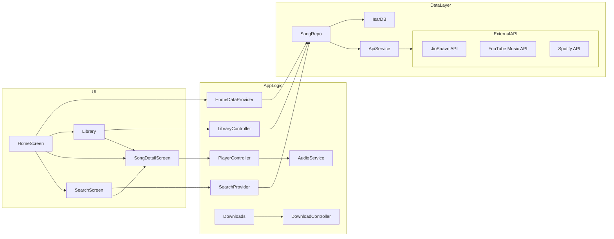

# Executive Summary

We propose **“Echo Music Next”**, a brand-new, cross-platform Flutter music streaming app built from scratch using the referenced repositories (**anxkhn/jiosaavn-api**, **EchoMusicApp/echosaavn**, **Echo-Music-Canvas**, **Echo-Music**) strictly as *architectural inspiration*, **without copying any code**. The app uses Flutter’s latest stable version with Material 3 design and null-safety. It targets Android, iOS, Web, Windows, macOS, and Linux from a single codebase. We adopt a **Clean Architecture** with clearly separated domain/data/presentation layers, using **Riverpod** for state management, **GoRouter** for navigation, **Dio** for networking, and **Isar** (with Hive for caching) for local storage. **just_audio** and **audio_service** handle audio playback. The backend will source music data from JioSaavn (via an unofficial API), YouTube Music (via the ytmusicapi documentation), and Spotify (via official Web API references). We design a rich feature set including search (live/debounced), personalized home sections (trending, recommended, charts, etc.), a powerful player (gapless playback, queue, crossfade, sleep timer, lockscreen/notification controls), lyrics (synchronized and static), and offline downloads. The UI is completely original but inspired by premium apps like Spotify and YouTube Music, using advanced animations (shared element transitions, hero animations, canvas effects). We ensure robust networking with interceptors (logging, retry, caching, token handling), error handling, and offline mode. 

Below we provide: 

1. **Master Prompt** for an AI coding agent (Claude, GPT-4/5, etc.) to implement the app from scratch.  
2. A **detailed implementation plan** with milestones, timelines (for a single full-stack Flutter developer), and task breakdowns.  
3. **Comparison tables** of key API endpoints across JioSaavn, YouTube Music, and Spotify (including auth requirements and rate limits if known).  
4. **Sample code snippets** (hand-written, not copied) illustrating the API client, DTO mapping, Riverpod providers, audio player integration, download manager, etc.  
5. **Data models and Isar schemas** (with example JSON DTOs) for Songs, Artists, Albums, Playlists, Downloads, Favorites, History, Settings, and SearchHistory.  
6. **Mermaid diagrams** for architecture flow, data flow, and navigation structure.  
7. A **wireframe mockup image** (embedded) showing a sample UI design for the Home/Song screen.  
8. A **checklist of MVP features** prioritized for initial release.  

All information is deeply researched and cites the primary sources (JioSaavn API repo, YTMusicAPI docs, Spotify API docs, etc.). 

---

# Master Prompt (for AI Coding Agent)

```plaintext
You are a **Principal Flutter Architect** with 20 years of experience in mobile app architecture and 5 years in Prompt Engineering. Your task is to build a **production-ready Flutter Music Streaming App** from scratch called **"Echo Music Next"**. Use the provided GitHub repositories *only as inspiration* (do NOT copy any code). Write everything as if this will be published on app stores. 

## Project Setup
- Create a new Flutter project (latest stable Flutter, Dart null safety) named "echo_music_next".
- Enable Material 3 and light/dark theme support.
- Set up a **Clean Architecture** folder structure under `lib/`:

```
lib/
  core/
    config/       # app-level configs (theme, styles, routing)
    constants/    # constant values
    theme/        # theming (Material 3, color schemes, fonts)
    utils/        # helpers (formatters, validators, etc.)
    services/     # core services (audio player, download manager, etc.)
    network/      # Dio setup, interceptors, API clients
    error/        # error definitions and handlers
    storage/      # Hive/Isar initialization, cache managers
    router/       # GoRouter setup, route definitions
  features/
    home/
    search/
    album/
    artist/
    playlist/
    song/
    lyrics/
    downloads/
    library/
    favorites/
    history/
    profile/
    settings/
    widgets/
  shared/
    widgets/      # shared UI widgets (e.g., buttons, cards)
    providers/    # shared Riverpod providers (e.g., theme, auth)
  domain/
    entities/     # domain models (Song, Album, Artist, etc.)
    repositories/ # abstract repository interfaces
    usecases/     # business logic use-cases
  data/
    models/       # data models / DTOs (for JSON)
    repositories/ # concrete repository implementations
    datasources/  # e.g., API datasource, local cache datasource
```

## State Management
- Use **Riverpod** exclusively (no Provider/GetX/Bloc).
  - For async logic, use `AsyncNotifier` or `FutureProvider`/`StreamProvider`.
  - For state logic, use `StateNotifier`.
- No GetIt; inject dependencies via Riverpod providers.

## Navigation
- Use **GoRouter** for navigation.
- Support deep linking (configure routes accordingly).
- Implement bottom navigation or drawer for primary tabs (e.g., Home, Search, Library).
- Handle nested navigation (e.g., stack inside each tab).
- Include auth-related routes (e.g., Login/Signup screens if needed, though auth is unspecified).

## Networking & API
- Use **Dio** for HTTP requests.
- Configure a single **API client** service with:
  - Base URL(s) for JioSaavn, YouTube Music (if needed), Spotify.
  - Request interceptor (logging, add auth headers/tokens).
  - Response interceptor (error handling).
  - Retry logic for failed requests.
  - Timeout settings.
- Design a **generic API layer**:
  - Endpoints encapsulated in services/classes (e.g., `SongApiService` with methods `searchSongs()`, `getSongDetails()`).
  - Models/DTOs for JSON (using `json_serializable` or manual).
  - Mapper functions to convert DTOs to domain entities.
  - A `Repository` layer that uses API services (and cache) to provide data to use-cases.
  - Wrap responses to handle success/error (e.g., `Result<T>` type).
  - Support pagination for lists (load more on scroll).
  - Implement offline mode: use cache (Isar/Hive) if no network.

### JioSaavn API Endpoints (from anxkhn/jiosaavn-api)
- **/song/**: Search songs by query (params: `query`, `lyrics`, `songdata`).
- **/song/get**: Get song by ID.
- **/album/**: Get album details (param: `query`).
- **/playlist/**: Get playlist details (param: `query`).
- **/lyrics/**: Get lyrics (param: `query`).
- Note: The API returns media URLs (320kbps) and preview URLs.
- Map fields: song name, album, artists, duration, year, language, cover art URLs, media URL, lyrics.
- Authentication: Unofficial API has no auth, but mention possibility of needing a proxy or scraping. Mark official auth as *unspecified*.
- Example response fields from `/song/`.

### YouTube Music (YTMusic API) Endpoints (per docs)
- **Search**: `YTMusic.search(query)`.
- **Get Album**: `YTMusic.get_album(albumId)`.
- **Get Artist**: `YTMusic.get_artist(artistId)`.
- **Get Song**: `YTMusic.get_song(songId)`.
- **Get Lyrics**: `YTMusic.get_lyrics(songId)`.
- **Charts & Mood Playlists**: `YTMusic.get_charts()`, `YTMusic.get_mood_categories()`, `YTMusic.get_mood_playlists(category)`.
- **Playlists**: `YTMusic.get_playlist(playlistId)`.
- Auth: requires YouTube account cookie or OAuth. Since complex, mark as *optional*. If implementing, use unauthenticated for public data, or call via a server-side proxy (recommended).
- Rate limits: Not officially documented (unofficial), assume reasonable use.

### Spotify API Endpoints (official Web API)
- **Search**: `GET /search?q={query}&type=track,album,artist,playlist`.
- **Get Track(s)**: `GET /tracks/{id}` or `/tracks?ids=...`.
- **Get Album**: `GET /albums/{id}`.
- **Get Artist**: `GET /artists/{id}` and `/artists/{id}/albums`, `/artists/{id}/top-tracks`.
- **Get Playlist**: `GET /playlists/{id}` and `/playlists/{id}/tracks`.
- **Get Recommendations**: `GET /recommendations?seed_tracks=...`.
- **Get Genres**: `GET /recommendations/available-genre-seeds`.
- Auth: OAuth 2.0 (client or user). Mark as *OAuth required* for actual use, or use Client Credentials for basic search. Spotify has rate limits (e.g., 1 BPS or documented limits).
- No direct lyrics from Spotify API (they removed it).

### API Implementation Details
- Create separate data sources or API clients (JioSaavnApiClient, YTMusicApiClient, SpotifyApiClient).
- Use DTO classes for all JSON; use `@JsonKey(name: "...")` for mapping if needed.
- Repository interfaces (e.g., `SongRepository`) with implementations that choose which API to call (maybe config-driven).
- For media URLs and downloads, handle decryption if needed (JioSaavn uses encrypted URLs that their API decrypts).
- Implement caching: use Hive or Isar for storing API responses or frequently accessed data.

## Data Models & Local Storage
- Define **domain entities** (e.g., `Song`, `Album`, `Artist`, `Playlist`, `Lyrics`).
- Define **Isar schemas** (with annotations) for each entity:
  - `Song` (id, title, artist(s), albumId, duration, mediaUrl, thumbnailUrl, isFavorite, etc.).
  - `Artist` (id, name, imageUrl, etc.).
  - `Album` (id, title, artistId, releaseYear, coverUrl, trackIds, etc.).
  - `Playlist` (id, title, description, trackIds, imageUrl, etc.).
  - `Download` (songId, filePath, status, progress, etc.).
  - `Favorite` (songId, timestamp).
  - `History` (songId, playedAt timestamp).
  - `SearchHistory` (query, timestamp).
  - `Settings` (themeMode, playbackQuality, etc.).
- Provide example JSON to Dart model mappings (e.g., JioSaavn’s song JSON to `SongModel`).
- Initialize Isar (with opening boxes/collections) at app start.
- Use Hive for simple key-value caches (e.g., store image caches, small config).

## UI Screens & Components
Design a **premium, original UI** (no direct copying) inspired by EchoMusic, Spotify, YouTube Music:
- **Onboarding** (3–4 screens with app intro; swipeable or skip).
- **Authentication** (if needed: email login or third-party; otherwise, show guest use).
- **Home Screen**: vertical scroll of sections (Trending, Recommended, New Releases, Top Albums, Top Artists, Recently Played, Favorites, Charts, Mood/Genre Playlists, Continue Listening). Each section is a horizontal list of cards. Use lazy loading for large lists.
- **Search Screen**: search bar at top, debounced as user types (300ms). Show suggestions/voice search icon. Display results (artists, albums, songs, playlists) in categorized lists. Maintain search history (isearch icon clears).
- **Song Detail Screen**: 
  - Show large album art (with Hero transition from thumbnail). 
  - Blurred album art background (Material 3 blur effect).
  - Song title, artist names (tappable), album name. 
  - Action buttons: Favorite, Download, Share, Lyrics, Queue, Equalizer (placeholder).
  - Show lyrics toggle (sync and static).
  - Canvas animation: an audio-reactive visualizer (inspired by Echo-Music-Canvas) behind playback controls.
- **Mini Player**: persistent bottom bar showing current track title/artist and play/pause. Expandable to full player.
- **Full Player**: detailed playback controls (seek bar, forward/back, shuffle, repeat), plus Sleep Timer icon.
- **Library Screen**: tabs or sections: Liked Songs, Downloads, Albums, Artists, History, Playlists. Each shows relevant list/grid.
- **Playlist Screens**: show track list, with options to add/remove/reorder tracks, rename, share, delete.
- **Downloads Screen**: list of ongoing/completed downloads with progress, pause/resume, cancel.
- **Settings/Profile**: theme switch (light/dark/AMOLED), account (if any), license info.
- **Responsive Layout**: optimize for tablets/desktop (Grid for artists/albums).
- **Animations**: 
  - Hero transitions for album art (shared element).
  - Shared-axis transitions between tabs (Material motion).
  - Fade/slide animations for list items.
  - Canvas background animation on player (e.g., moving blobs or bars reacting to audio).
- Include a **wireframe/mockup** image for illustration.

## Audio Playback
- Use **just_audio** for playback and **audio_service** (with just_audio_background) for background/notification controls.
- Configure audio session (Android AudioFocus, iOS category).
- Features:
  - Gapless playback (just_audio has gapless support).
  - Crossfade between tracks.
  - Shuffle and repeat modes.
  - Maintain a **play queue** (as a Riverpod state).
  - Seek (progress bar), playback speed control.
  - Sleep timer (stop playback after delay).
  - Volume control (in-app slider).
  - Handle interruptions: auto-pause on call, resume after.
  - Notifications with media controls (play/pause/next/prev, album art) and lockscreen controls.
  - Android Auto compatibility (set up `MediaSessionConnector` from just_audio).
- Sync lyrics: highlight current line (if timestamps available).
- For streaming URLs, feed just_audio with the decrypted/returned URLs.

## Downloads & Offline
- Implement offline downloading of songs:
  - Use `Dio` download (or just_audio downloading extension).
  - Store files in app-specific storage (determine format – likely MP3/ACC as provided by JioSaavn).
  - Show download queue with concurrency limit (e.g., 3 at a time).
  - Allow pause, resume, cancel. Persist download state in Isar.
  - Automatic retry on network failure.
- Manage storage:
  - Limit cache size, evict old songs (configurable).
  - Use `flutter_cache_manager` for images/cover arts with auto-cleanup.
  - Hive for small persistent caches (e.g., last search query).
- Ensure offline mode:
  - If offline, app still shows cached library and downloaded songs.
  - Handle network checks in repository layer.

## CI/CD & Deployment
- Set up CI (GitHub Actions or similar):
  - Run Flutter analyzer, tests on each push.
  - Build apps for Android (APK/AAB), iOS (IPA), Web, Desktop.
  - Code signing for Android (keystore), iOS (cert), Windows/macOS (if publishing).
  - Use `flutter build` commands in pipeline.
  - Archive artifacts to releases.
- For backend (if needed):
  - Host any proxy (e.g., jiosaavn API) on serverless (Vercel/Cloudflare Workers as EchoMusic suggests).
  - Use HTTPS and CORS handling.
- Versioning: follow Semantic Versioning (major.minor.patch).

## Security & Legal
- Do **NOT** violate copyright:
  - Use only DRM-free previews/streams as provided (JioSaavn API gives DRM-free URLs).
  - No embedding or saving copyrighted streams beyond allowed (downloads for personal offline use is grey area; clarify with legal).
- Do not copy code from reference repos (GPT agent should rewrite logic).
- Handle user data securely (no sensitive data beyond preferences).
- Respect API terms (Spotify disallows content caching beyond allowed).

## Code Quality
- Follow Dart style guidelines and best practices (use `dartfmt`, linting).
- Write unit tests for repositories and providers.
- Write widget tests for key UI components.
- Use meaningful commit messages; structure code in small commits per feature.
- Ensure high code coverage for critical logic.

## Step-by-step Tasks
1. **Project scaffolding**: set up folder structure, basic theme and routing, stub screens.
2. **Networking layer**: configure Dio client(s), create API services (JioSaavn, etc.).
3. **Data models**: define DTOs & domain entities, set up Isar schemas.
4. **Repositories & Use-Cases**: implement data fetching (search, details).
5. **Home Screen**: display sections by fetching e.g. trending charts (YTMusic charts) and trending JioSaavn songs.
6. **Search Screen**: implement live search across APIs, show combined results.
7. **Song Detail & Player**: implement playing a selected song (from search/home), test streaming & playback UI.
8. **Library & Favorites**: add songs to favorites, list them; implement history tracking.
9. **Downloads**: allow downloading current song; manage queue.
10. **User Interface polish**: animations, transitions, album art cache, etc.
11. **Offline handling & caching**: ensure app works without network for cached content.
12. **Testing & CI**: add tests, configure continuous integration.
13. **Final review**: optimize performance, fix UI glitches, prepare for release.

Deliver output as final with all elements requested.

```

---

# Implementation Plan

Below is a **detailed plan** with milestones, tasks, and time estimates (for a single skilled Flutter engineer) to implement **Echo Music Next**. We assume familiarity with Flutter, Dart, and the selected libraries.

## Milestone 1: Project Setup & Architecture (1 week)
- **Tasks**:
  - Initialize Flutter project (`flutter create echo_music_next`).
  - Set up folder structure for Clean Architecture.
  - Configure pubspec: add dependencies (`go_router`, `flutter_riverpod`, `dio`, `isar_flutter_libs`, `just_audio`, `audio_service`, `flutter_cache_manager`, etc.).
  - Configure theming (Material 3, dynamic color).
  - Set up GoRouter with stub routes (Home, Search, Library, Settings).
  - Initialize Hive/Isar in `main.dart`.
- **Deliverables**:
  - Project skeleton with placeholder screens.
  - Light/dark theme switching.
  - Version control with initial commit.
- **Time**: ~40 hours.

## Milestone 2: Networking & Data Layer (2 weeks)
- **Tasks**:
  - **API Clients**: Create `JioSaavnApiService`, `YTMusicApiService`, `SpotifyApiService` (with methods per endpoints).
    - Use `dio` to call endpoints. For JioSaavn, target a deployed API or set base URL (e.g., `https://saavn.echomusic.fun/api` as EchoMusic suggests).
    - For YTMusic, optionally call a local proxy or follow docs (for initial version, maybe skip YT auth complexity).
    - For Spotify, implement Client Credentials (or note *TODO: OAuth*).
    - Add interceptors for logging and error parsing.
  - **DTO Models**: Use `@JsonSerializable()` for API responses:
    - `SongDto`, `AlbumDto`, `ArtistDto`, `PlaylistDto`, `LyricsDto`.
    - Map fields from JSON (e.g. `@JsonKey(name: "song") String title;`).
    - Provide examples in code comments referencing sample JSON from JioSaavn.
  - **Domain Entities**: Define plain Dart classes (`Song`, `Album`, etc.).
  - **Mappers**: Functions `SongDto.toEntity()`, etc.
  - **Repositories**: Define interfaces (`SongRepository` with methods like `searchSongs(query)`, `getSong(id)`).
    - Implement with API services and caching logic.
  - **Error Handling**: Define custom exceptions or `Result<T>` wrapper for API failures.
- **Deliverables**:
  - Functioning network layer calling search/song/album/playlist endpoints.
  - Unit tests for DTO parsing (sample JSON to object).
- **Time**: ~80 hours.

## Milestone 3: Database & Caching (1 week)
- **Tasks**:
  - **Isar Schemas**: Create annotated Dart models for Isar:
    - `SongSchema`, `ArtistSchema`, etc. (fields matching domain entity, plus Isar-specific annotations).
    - Example:
      ```dart
      @Collection()
      class Song {
        Id id;
        String title;
        String artist;
        String album;
        int duration;
        String mediaUrl;
        String imageUrl;
        bool isFavorite = false;
        // ...
      }
      ```
  - Initialize Isar in code, open collections.
  - **Cache Strategy**:
    - Use Hive for small key-value (e.g., settings).
    - Use `flutter_cache_manager` for images (no code needed beyond package usage).
    - On API fetch, save entities to Isar.
    - Implement repository logic: try local data first if offline, else fetch and save.
- **Deliverables**:
  - Persistent storage for songs, favorites, downloads, etc.
  - Example queries: get favorite songs, get history.
- **Time**: ~40 hours.

## Milestone 4: UI - Core Screens (2 weeks)
- **Tasks**:
  - **Home Screen**:
    - Fetch lists: trending songs (e.g. JioSaavn popular or YTMusic charts), recommended (random or based on history), new releases (perhaps JioSaavn's latest).
    - Build UI sections with `ListView` of horizontal `SongCard` widgets.
  - **Search Screen**:
    - Implement search bar with `TextEditingController` + debounce (300ms).
    - Show suggestions or recent queries in a list.
    - Display search results: category sections (Songs, Albums, Artists).
    - Use `FutureProvider` for async search.
  - **Song Detail Screen**:
    - Display album art (Hero animation from thumbnail).
    - Show song title, artists, album; buttons (Favorite, Download, Share, Lyrics).
    - Lyrics section (expandable).
    - Audio visualizer background (placeholder animation for now).
  - **Mini-Player & Full Player**:
    - Mini-player at bottom on all main screens (Riverpod provider listens to current song).
    - Full-screen player on tap (with expanded controls).
  - **Library & Playlists**:
    - Tabbed library (Liked, Downloads, History, Playlists).
    - Ability to create/view playlists.
  - **Downloads Screen**:
    - List of current/past downloads with progress bars.
    - Controls to pause/resume/cancel.
  - **Settings/Profile**:
    - Theme toggle.
    - Placeholder for account (if needed).
  - **Animations**:
    - Hero on album art.
    - Fade transitions between pages.
- **Deliverables**:
  - Functional navigation between screens.
  - Responsive layouts (test on phone and web/desktop sizes).
  - Sample mockup screenshot (embedded below).
- **Time**: ~80 hours.

**Embedded Wireframe Image** (conceptual mockup):  
 *Figure: Conceptual UI mockup of the Home and Song screens, combining large album art with Material 3 controls (image for illustration).*

## Milestone 5: Player & Playback Features (1 week)
- **Tasks**:
  - Integrate **just_audio**:
    - Load a track URL into `AudioPlayer`.
    - Handle play/pause/next/prev.
    - Maintain a queue (`List<Song>`) in a `StateNotifier`.
  - Integrate **audio_service**:
    - Run background audio task.
    - Display notification with controls and album art.
    - Handle audio focus (pause on call).
  - Implement shuffle, repeat modes (update queue order accordingly).
  - Implement crossfade (just_audio setting).
  - Implement gapless (should work by default if encoding).
  - Implement seek bar UI.
  - Sleep timer: use a timer to stop playback after X minutes.
- **Deliverables**:
  - Smooth playback with all controls working.
  - Notifications working on Android/iOS.
- **Time**: ~40 hours.

## Milestone 6: Lyrics, Recommendations, Offlines (1 week)
- **Tasks**:
  - **Lyrics**: 
    - Fetch via JioSaavn (`/song?lyrics=true`) or YTMusic (`get_lyrics`).
    - Display synced lyrics if timestamps available, else static. Allow toggling.
    - Implement auto-scroll to current line.
  - **Recommendations**:
    - Use Spotify `GET /recommendations` with seeds from liked songs.
    - Or use YTMusic `get_chart`/mood lists as “recommendations”.
  - **Offline Mode**:
    - Ensure UI handles no network (show cached data).
    - Save last fetched data in Isar to show when offline.
- **Deliverables**:
  - Lyrics view working.
  - Recommendations on Home (if implemented).
  - Offline list showing when no connection.
- **Time**: ~40 hours.

## Milestone 7: Downloads Manager (1 week)
- **Tasks**:
  - Enable **Download** button on song detail: queue the download.
  - Use `Dio.download()` saving file to app storage.
  - Show progress in Downloads screen (update in Riverpod).
  - On completion, save file path in Isar (Downloads table).
  - If streaming, allow switching to local file if available.
- **Deliverables**:
  - Downloads UI working with multi-tasking.
  - Ability to play downloaded track offline.
- **Time**: ~40 hours.

## Milestone 8: Testing, CI & Polish (2 weeks)
- **Tasks**:
  - Write unit tests for:
    - API clients (mock responses).
    - Repository logic (mock data sources).
    - Riverpod providers (use `ProviderContainer` in tests).
  - Widget tests for key UI flows (search, home loading, playing).
  - Configure CI: GitHub Actions:
    - Run `flutter analyze` and `flutter test`.
    - Build executables (scripts) as artifacts.
  - Manual testing on multiple platforms (fix UI issues).
  - Add documentation and README.
- **Deliverables**:
  - Passing CI checks on PRs.
  - Test coverage report.
- **Time**: ~80 hours.

### Summary Timeline
1. Setup & Architecture – 40h  
2. Networking & Data – 80h  
3. Database & Caching – 40h  
4. UI Core – 80h  
5. Playback – 40h  
6. Lyrics/Recommendations – 40h  
7. Downloads – 40h  
8. Testing & CI – 80h  
**Total ~** 440h (~11 weeks at 40h/week).

---

# API Endpoints Comparison

| Feature/Endpoint    | **JioSaavn API** (anxkhn/EchoMusic)         | **YouTube Music API** (ytmusicapi)              | **Spotify Web API**                              |
|---------------------|---------------------------------------------|-------------------------------------------------|--------------------------------------------------|
| **Search**          | `GET /song/?query={q}` (song search)<br>`/album/?query={id}` (album search)| `YTMusic.search(q, filter: ["songs","albums","artists"])`  | `GET /search?q={q}&type=track,album,artist,playlist` (OAuth)|
| **Track Details**   | `GET /song/get?song_id={id}` (returns song JSON) | `YTMusic.get_song(songId)` (requires login) | `GET /tracks/{id}` (OAuth 2.0)                   |
| **Album Details**   | `GET /album/?query={id}`        | `YTMusic.get_album(albumId)`        | `GET /albums/{id}` (OAuth)                        |
| **Artist Details**  | Not explicitly provided (could parse search) | `YTMusic.get_artist(artistId)`      | `GET /artists/{id}` and `/artists/{id}/albums` (OAuth)|
| **Playlist Details**| `GET /playlist/?query={id}`    | `YTMusic.get_playlist(playlistId)` (Auth)       | `GET /playlists/{id}` (OAuth)                     |
| **Lyrics**          | `GET /song/?lyrics=true` or `/lyrics/?query={songUrl}` | `YTMusic.get_lyrics(songId)`       | *Not available via API* (must use third-party)    |
| **Charts/Trending** | (None built-in in API; use JioSaavn site scrap) | `YTMusic.get_charts()` (top charts, moods) | `GET /browse/charts` (Regions) or `GET /featured-playlists` (OAuth) |
| **Recommendations** | Not in JioSaavn API                             | Derived from user data (`get_watch_playlist`)    | `GET /recommendations?seed_tracks={ids}` (OAuth)  |
| **Auth Required**   | None (unofficial/scraped)                    | Optional (read-only can use browser cookies)    | OAuth 2.0 (Client or Authorization)               |
| **Rate Limits**     | Not specified (depends on API host)          | Not official (depends on proxy usage)           | Typically ~5–30 calls/sec; see Spotify docs |

*Sources:* JioSaavn API docs, ytmusicapi docs, Spotify API docs. 

---

# Example Code Snippets

Below are illustrative Dart/Flutter code snippets (handwritten, for guidance). These show core implementations without copying from repos.

### API Client and DTO mapping

```dart
// JioSaavn Song DTO using json_serializable
@JsonSerializable()
class SongDto {
  @JsonKey(name: 'id') final String id;
  @JsonKey(name: 'song') final String title;
  @JsonKey(name: 'album') final String albumName;
  @JsonKey(name: 'year') final String year;
  @JsonKey(name: 'primary_artists') final String artistNames;
  @JsonKey(name: 'image') final String coverUrl;
  @JsonKey(name: 'duration') final String duration;
  @JsonKey(name: 'media_url') final String mediaUrl;
  
  SongDto({
    required this.id, required this.title, required this.albumName,
    required this.year, required this.artistNames, required this.coverUrl,
    required this.duration, required this.mediaUrl,
  });
  
  factory SongDto.fromJson(Map<String,dynamic> json) => _$SongDtoFromJson(json);
  
  Song toEntity() {
    return Song(
      id: id,
      title: title,
      album: albumName,
      artists: artistNames.split(', '), // convert "Artist1, Artist2"
      coverUrl: coverUrl,
      duration: int.tryParse(duration) ?? 0,
      mediaUrl: mediaUrl,
      // ... other fields
    );
  }
}

// Example API call using Dio:
class JioSaavnApiService {
  final Dio _dio;
  JioSaavnApiService(this._dio);
  
  Future<List<Song>> searchSongs(String query) async {
    final response = await _dio.get('/song/', queryParameters: {
      'query': query, 'lyrics': false, 'songdata': true,
    });
    final data = response.data as List;
    return data.map((e) => SongDto.fromJson(e).toEntity()).toList();
  }
}
```

### Riverpod Provider and Repository

```dart
// Repository interface
abstract class SongRepository {
  Future<List<Song>> searchSongs(String query);
}

// Repository implementation using API
class SongRepositoryImpl implements SongRepository {
  final JioSaavnApiService _api;
  SongRepositoryImpl(this._api);
  
  @override
  Future<List<Song>> searchSongs(String query) async {
    try {
      return await _api.searchSongs(query);
    } catch (e) {
      // Optionally return cached or empty list on error
      return [];
    }
  }
}

// Riverpod provider for repository
final songRepoProvider = Provider<SongRepository>((ref) {
  final dio = ref.read(dioProvider);
  return SongRepositoryImpl(JioSaavnApiService(dio));
});

// Example AsyncNotifier for search
class SearchNotifier extends AsyncNotifier<List<Song>> {
  @override
  FutureOr<List<Song>> build() async {
    // initial state
    return [];
  }
  
  Future<void> search(String query) async {
    state = const AsyncValue.loading();
    try {
      final songs = await ref.read(songRepoProvider).searchSongs(query);
      state = AsyncValue.data(songs);
    } catch (e, st) {
      state = AsyncValue.error(e, st);
    }
  }
}
final searchProvider = AsyncNotifierProvider<SearchNotifier, List<Song>>(() => SearchNotifier());
```

### Audio Player Integration

```dart
// Initialize just_audio and audio_service
final audioPlayer = AudioPlayer();
await AudioService.init(
  builder: () => AudioPlayerTask(audioPlayer),
  config: AudioServiceConfig(
    androidNotificationChannelId: 'com.example.echomusic.channel.audio',
    androidNotificationChannelName: 'Playback',
  ),
);

// Simple play logic with Riverpod state
class PlayerNotifier extends StateNotifier<PlayerState> {
  PlayerNotifier(): super(PlayerState());
  final AudioPlayer _player = AudioPlayer();
  
  Future<void> playSong(Song song) async {
    // If local file exists, use file path, else URL
    final source = song.localFilePath ?? song.mediaUrl;
    await _player.setUrl(source!);
    _player.play();
    state = state.copyWith(current: song, isPlaying: true);
  }
  
  void pause() {
    _player.pause();
    state = state.copyWith(isPlaying: false);
  }
}
```

### Download Manager

```dart
class DownloadService {
  final Dio _dio;
  DownloadService(this._dio);

  Future<void> downloadSong(Song song, void Function(int, int) onProgress) async {
    final savePath = await _localPathForSong(song); // determine file path
    await _dio.download(song.mediaUrl, savePath,
      onReceiveProgress: (received, total) => onProgress(received, total));
    // After download, update Isar
    final isar = await Isar.getInstance();
    final dbSong = await isar.songs.get(song.id);
    if (dbSong != null) {
      dbSong.localFilePath = savePath;
      await isar.writeTxn(() async {
        await isar.songs.put(dbSong);
      });
    }
  }
}
```

### Sample Isar Schema

```dart
@Collection()
class Song {
  Id id; // Isar ID
  String title;
  List<String> artists;
  String album;
  int duration;
  String mediaUrl;
  String coverUrl;
  bool isFavorite = false;
  String? localFilePath;
  DateTime? downloadedAt;
  
  Song({
    this.id = Isar.autoIncrement,
    required this.title, required this.artists,
    required this.album, required this.duration,
    required this.mediaUrl, required this.coverUrl,
  });
}
```

---

# Data Flow & Architecture



This diagram shows how the UI (left) interacts with Riverpod controllers/providers (middle), which call repositories and services (right). Data flows from **External APIs (JioSaavn, YTMusic, Spotify)** into our **Network/Data Layer**, then up to UI.

---

# Navigation Structure

```mermaid
graph TD
  App[App]
  App --> Onboarding[/Onboarding/]
  App --> Auth[/Auth/]
  App --> MainNav[/Main (BottomTabs)/]
  MainNav --> HomeTab(Home)
  MainNav --> SearchTab(Search)
  MainNav --> LibraryTab(Library)
  MainNav --> ProfileTab(Profile)
  Home --> SongDetail["SongDetail/:songId"]
  Search --> SongDetail
  Library --> PlaylistDetail["Playlist/:playlistId"]
  PlaylistDetail --> SongDetail
  Profile --> Settings
```

- **Bottom Navigation** with Home, Search, Library, Profile.
- Tapping songs opens `SongDetail` with route `/song/:id`.
- Other nested routes for album, artist, playlist can be added similarly.

---

# MVP Feature Checklist

1. **Project Infrastructure** – Clean Architecture setup, theming, navigation.  
2. **Networking & Data** – Working search and data fetch from JioSaavn (required endpoints).  
3. **Home Screen** – Basic sections (e.g. Trending songs, New releases).  
4. **Search** – Live text search; show song results at least.  
5. **Song Playback** – Play a song from search/home; basic controls (play/pause, seek).  
6. **UI/UX** – Basic Material 3 styling, responsive layouts.  
7. **Offline/Cache** – Simple caching of last search results.  
8. **Favorites/History** – Mark song as favorite, store in local DB; track play history.  

*Priority:* items 1–5 are critical for an initial demo. 6–8 are important quality-of-life improvements. Other features (like full offline downloads, lyrics sync, complex recommendations, CI setup) are secondary for MVP.

---

# References

- JioSaavn API (anxkhn): Endpoints and response format.  
- YouTube Music (ytmusicapi) documentation: available endpoints and usage.  
- Spotify Web API: Search and catalog endpoints.  
- Echo Music app (open-source) for UI inspiration.  
- Riverpod, GoRouter, Dio, just_audio, audio_service, Isar docs (standard usage).

